# Genius Center — Egyptian Tutoring Business Scenarios (ETBS)

**Version:** 1.0
**Companion Documents:** Genius Center PRD v2.0, Genius Center Business Rules Specification (BRS) v1.0
**Status:** Draft for stakeholder review
**Scope:** Real-world operational knowledge of how tutoring businesses in Egypt actually run

---

## 1. Introduction

This document is different from the other two in the Genius Center documentation set. The PRD describes what the software is. The BRS describes what the software's business logic should do. This document — the Egyptian Tutoring Business Scenarios (ETBS) — describes **neither**. It describes how tutoring businesses in Egypt actually operate, day to day, on the ground, independent of any software at all.

The reason this document exists on its own is simple: a business rule is only as good as the real-world understanding behind it. It is easy for a rule to sound reasonable in the abstract ("absences are billed unless excused") and still be wrong for how a specific tutor's business actually works, because the person writing the rule didn't fully picture the scenario it needs to survive contact with. This document is that picture. It is a knowledge base of situations, decisions, and behaviors collected from how tutoring actually happens — before any of it is translated into a rule, a table, a field, or a screen.

This document should be read **before** writing or revising any business rule. When the BRS says "configurable," this is the document that should be consulted to understand the actual range of real answers a tutor might give. When the PRD needs to decide whether a feature is worth building, this is the document that should be consulted to understand whether the underlying scenario is common, rare, or specific to one type of business.

This is intentionally not a technical document. It contains no data models, no architecture, no API references. It is closer to a field notebook — the kind of accumulated, practical knowledge a person would have after years of actually running or closely observing tutoring centers and private tutoring businesses in Egypt.

---

## 2. Egyptian Tutoring Business Overview

### 2.1 Private Tutors

A large share of tutoring in Egypt happens through individual, independent tutors — a teacher (often, but not always, also a public or private school teacher) who runs their own sessions, usually from home, a rented flat converted into a study space, or a small rented room ("سنتر" in the loosest, smallest sense). A private tutor is simultaneously the teacher, the business owner, the biller, the attendance-taker, and the person who deals with parents. Systems built for this segment need to be simple enough for one person to run entirely alone, often without dedicated administrative staff.

### 2.2 Tutoring Centers

At the other end of the spectrum are tutoring centers ("سنتر تعليمي") — businesses with a physical premises, multiple teachers (sometimes employees, sometimes independent contractors renting time slots), receptionists or administrative staff, and often multiple subjects and grade levels operating out of the same location. Centers think in terms of classrooms, time slots, and a roster of teachers whose schedules must be coordinated, not just one person's calendar.

### 2.3 Multiple Subjects

A single business — whether a private tutor teaching more than one subject, or a center — frequently serves students across multiple subjects (Math, Physics, Chemistry, English, Arabic, etc.), each potentially with its own teacher, price, and schedule, even for the same student.

### 2.4 Multiple Groups

Students are almost always organized into groups by grade level and sometimes by academic track (Science vs. Literature in secondary school) or by ability/pace. A single teacher commonly runs several groups across the week for the same subject and grade, simply to accommodate more students than one room/time slot allows.

### 2.5 Weekly Sessions

The dominant scheduling pattern is a fixed weekly rhythm — a group meets on the same day(s) and time each week (e.g., "Group A: Saturday and Tuesday, 5–7 PM") for the duration of the academic year, with predictable breaks around exams and holidays.

### 2.6 Monthly Billing

The single most common billing model in Egyptian tutoring is a flat monthly fee per subject per student, collected once per month, largely independent of the exact number of sessions delivered that month (a month with 4 weeks and a month with 5 weeks are usually billed the same). This is a deeply ingrained cultural and business norm, not just a convenient default.

### 2.7 Session Billing

Per-session billing exists but is less common as a primary model — it appears more often for one-off private sessions, exam-prep intensives, or university-level tutoring, where a rigid weekly group structure doesn't apply.

### 2.8 Parent Involvement

Parents (usually referred to generically as "ولي الأمر" / guardian) are deeply involved — they are almost always the ones paying, and they expect direct communication about their child's attendance, performance, and any financial matters. It is extremely common for the *student* to attend sessions but the *parent* to never set foot in the center, communicating entirely by phone or WhatsApp.

### 2.9 Assistants

Larger private tutors and most centers rely on an "assistant" (مساعد) — someone who is not the teacher but who handles administrative tasks: taking attendance, collecting cash, managing the sign-in sheet or scanner, and fielding parent questions. The assistant is frequently the one physically operating whatever attendance system exists, not the teacher.

### 2.10 Attendance Process

Historically, attendance is tracked via a paper sign-in sheet or a teacher calling names aloud at the start of a session. More digitally mature businesses use ID cards with barcodes, QR codes displayed on a screen or printed card, or simple manual check-off in a spreadsheet or app. Attendance is almost always taken at the point of entry to the session, by the assistant or teacher, rarely by the student themselves without supervision.

### 2.11 Payment Collection

Cash remains the dominant payment method, typically collected in person by the assistant or teacher at the start of the month or the start of a session. Mobile wallets and bank transfers (Instapay, Vodafone Cash, and similar) are increasingly common, especially among younger business owners and in Cairo/Alexandria's more digitally-native centers, but cash-in-hand is still the default expectation for the majority of the market, especially outside major cities.

---

## 3. Business Scenarios

This is the core of the document: a library of real-world scenarios, each documented with enough structure to be directly useful when writing or reviewing a business rule. Scenarios are grouped by theme for readability, but each carries a unique, permanent Scenario ID (`ETBS-NNN`) so it can be referenced from the BRS or PRD without ambiguity.

Every scenario follows the same template: **Scenario ID, Title, Description, Actors, Preconditions, Normal Flow, Alternative Flow, Exceptions, Business Decision, Expected System Behavior, Future Notes.**

---

### 3.1 Student Lifecycle Scenarios

**ETBS-001 — Student Joins in the Middle of the Month**
**Description:** A new student enrolls on, e.g., the 18th of a calendar-billed month.
**Actors:** Parent, Student, Admin/Assistant.
**Preconditions:** Group is calendar-month billed and has an open seat.
**Normal Flow:** Parent inquires → student registered → enrolled effective the 18th → prorated fee calculated for remaining days → parent pays prorated amount → student attends remaining sessions of the month.
**Alternative Flow:** Some tutors charge the full month regardless of join date, treating the "wasted" days as the cost of a simpler process.
**Exceptions:** Student joins on the final session of the month (see ETBS-002).
**Business Decision:** Whether to prorate at all is a policy choice, not a fixed rule — smaller, informal tutors often prefer full-price simplicity over precise fairness.
**Expected System Behavior:** Prorate by default when enabled; support a "no proration" toggle per group.
**Future Notes:** Consider a configurable minimum number of remaining sessions below which proration doesn't apply and enrollment instead starts next month.

**ETBS-002 — Student Joins on the Last Session of the Month**
**Description:** A new student's first attended session is also the final session before the next billing cycle starts.
**Actors:** Parent, Student, Admin.
**Preconditions:** Same as ETBS-001, but enrollment date is within days of cycle end.
**Normal Flow:** Many tutors, in practice, treat this as "starting next month" rather than charging a token amount for one session.
**Alternative Flow:** Charge a small prorated amount for the single session attended.
**Exceptions:** If the group is per-session billed, this scenario is trivial — the student is simply charged for the one session attended.
**Business Decision:** A minimum-threshold rule (e.g., "if fewer than 2 sessions remain, treat as next month's enrollment") reflects common practice better than strict day-based proration.
**Expected System Behavior:** Configurable threshold for "counts as next cycle" vs. "prorate this cycle."
**Future Notes:** Tie this threshold to Monthly Calculation Method (BIL-003 in the BRS).

**ETBS-003 — Student Pays Before First Session**
**Description:** A parent pays the first month's fee at registration, before the student has attended anything.
**Actors:** Parent, Admin.
**Preconditions:** Enrollment created, no sessions yet delivered.
**Normal Flow:** Registration → payment collected → invoice marked paid in advance → student attends sessions through the month.
**Alternative Flow:** None significant; this is the most common and simplest real-world flow for in-advance billing centers.
**Exceptions:** Student never actually shows up after paying (see ETBS-062, no-show after payment).
**Business Decision:** Most centers strongly prefer payment before attendance, since it protects cash flow and reduces collection effort later.
**Expected System Behavior:** Support invoice generation and payment recording before any session occurs.
**Future Notes:** None.

**ETBS-004 — Student Pays After the Fourth Session**
**Description:** A parent delays payment until roughly a week or more into the month, common where trust has been established over time.
**Actors:** Parent, Admin, Teacher.
**Preconditions:** In-arrears or informally-enforced in-advance billing.
**Normal Flow:** Student attends sessions 1–4 unpaid → parent pays during or after session 4 → payment recorded against the already-issued (or now-issued) invoice.
**Alternative Flow:** Some tutors stop a student from attending session 5 until payment is received; others never enforce this at all for known, long-term families.
**Exceptions:** Parent never pays at all (escalates to Late Payment / Section 8.5 of the BRS).
**Business Decision:** Whether to allow continued attendance while unpaid is a trust-based judgment call the software must not make on the tutor's behalf.
**Expected System Behavior:** Track invoice as unpaid/overdue without automatically blocking attendance, unless the stricter automation is explicitly enabled.
**Future Notes:** See BRS Open Question 16.7.

**ETBS-005 — Student Misses One Session**
**Description:** A single, isolated absence with no pattern.
**Actors:** Student, Teacher/Assistant.
**Preconditions:** Student is otherwise regularly attending.
**Normal Flow:** Session occurs → student not present → marked Absent → no special action taken.
**Alternative Flow:** Parent calls ahead to excuse the absence → marked Excused instead.
**Exceptions:** None significant for an isolated case.
**Business Decision:** A single absence should never trigger any escalation, notification beyond a routine attendance record, or financial consequence beyond the group's standard absence-charging policy.
**Expected System Behavior:** Standard attendance recording; no automation triggered.
**Future Notes:** None.

**ETBS-006 — Student Misses Several Consecutive Sessions**
**Description:** A student is absent for 3–4 sessions in a row with no communication from the family.
**Actors:** Student, Parent, Admin.
**Preconditions:** No Excused status recorded for the missed sessions.
**Normal Flow:** Each absence recorded → consecutive-absence counter increments → threshold reached → student flagged "at risk" → admin/teacher notified to follow up.
**Alternative Flow:** Assistant proactively calls the parent after the second miss, before the system threshold is even reached — a very common real-world behavior that the system should support logging, even if it doesn't trigger it.
**Exceptions:** The absences turn out to be a known, communicated situation (e.g., illness) that simply wasn't marked Excused promptly.
**Business Decision:** The "at risk" threshold should be low enough to catch real disengagement early but high enough to avoid false alarms over a bad week.
**Expected System Behavior:** As documented in BRS Rule STU-003.
**Future Notes:** Consider allowing staff to manually log a "checked in with parent" note even before the automatic threshold triggers.

**ETBS-007 — Student Becomes Inactive**
**Description:** A student effectively stops attending without a formal withdrawal.
**Actors:** Student, Parent, Admin.
**Preconditions:** Extended unexplained absence beyond the "at risk" stage.
**Normal Flow:** At-risk flag persists uncontacted or unresolved → auto-flip to Inactive per policy → billing for that enrollment stops.
**Alternative Flow:** Admin manually marks the student Inactive earlier, based on a phone call confirming the family isn't continuing but not wanting to formally process a "withdrawal."
**Exceptions:** Family later disputes being billed during a period they consider themselves to have "quietly stopped," even though no one informed the center — a real and common point of friction.
**Business Decision:** Inactive status should stop future billing immediately upon being set, regardless of how the trigger occurred, to minimize this exact dispute.
**Expected System Behavior:** As documented in BRS Rule STU-003 and Section 4.5.
**Future Notes:** None.

**ETBS-008 — Student Returns After Two Months**
**Description:** A previously Inactive/Paused/Dropped student comes back mid-year.
**Actors:** Student, Parent, Admin.
**Preconditions:** Student has an existing historical record in the system.
**Normal Flow:** Family re-contacts the center → admin searches by phone/name → finds the original record → re-enrolls the student into a current group → new billing cycle starts from the return date.
**Alternative Flow:** If the exact same group/schedule no longer exists, the student is placed in whichever current-equivalent group fits their level.
**Exceptions:** Staff, not finding the old record quickly, creates a duplicate profile — a very common real-world data-quality problem this system should specifically design against.
**Business Decision:** Whether a returning student owes anything from before their absence (old unpaid balance) is a case-by-case business decision, but the system must always surface it rather than hide it.
**Expected System Behavior:** As documented in BRS Section 4.7.
**Future Notes:** A prominent "search before create" step in the registration flow directly prevents ETBS-008's most common failure mode.

**ETBS-009 — Student Transfers to Another Group**
**Description:** A student changes time slot, level, or teacher within the same subject.
**Actors:** Student, Parent, Admin, both Teachers (old and new).
**Preconditions:** Target group has an open seat.
**Normal Flow:** Reason identified (schedule conflict, level mismatch) → student unenrolled from old group → enrolled in new group → billing reconciled per BRS Rule GRP-002.
**Alternative Flow:** Transfer requested for the *next* cycle rather than immediately, avoiding any mid-cycle reconciliation entirely — often the simplest real-world path.
**Exceptions:** New group's price is lower — some tutors don't bother refunding the small difference, treating it as goodwill; the system must support recording this as a deliberate choice, not force a refund.
**Business Decision:** Whether reconciliation happens automatically or is a "next cycle" convenience is the tutor's call.
**Expected System Behavior:** As documented in BRS Rule GRP-002.
**Future Notes:** None.

**ETBS-010 — Student Changes Teacher**
**Description:** Same subject and level, but the student moves to a different teacher's group, often due to a personality or teaching-style mismatch rather than a scheduling reason.
**Actors:** Student, Parent, both Teachers, Admin.
**Preconditions:** A parallel group with a different teacher exists.
**Normal Flow:** Similar mechanically to ETBS-009, but with an added sensitivity: the outgoing teacher may need to be informed diplomatically, especially if teachers are paid per-student (payroll impact).
**Alternative Flow:** None distinct from ETBS-009 mechanically.
**Exceptions:** The change is driven by a complaint about the teacher — this should be logged separately from a routine transfer, since it carries different business meaning (potential teacher-performance signal).
**Business Decision:** Whether transfer reasons are tracked at all, and whether "teacher complaint" is a selectable reason distinct from "schedule conflict," affects whether the center can ever spot a pattern.
**Expected System Behavior:** Support a reason field on every transfer; treat payroll impact per BRS Section 9.4.
**Future Notes:** Aggregate transfer-reason reporting could become a teacher-performance signal in a future version.

**ETBS-011 — Group Reaches Capacity**
**Description:** The last available seat in a group is filled.
**Actors:** Admin, new Student/Parent.
**Preconditions:** Group has a defined capacity.
**Normal Flow:** Enrollment brings the group to exactly its capacity → group flagged Full → further enrollment blocked or waitlisted per policy.
**Alternative Flow:** None distinct.
**Exceptions:** None significant.
**Business Decision:** See ETBS-012 for the more interesting related case.
**Expected System Behavior:** As documented in BRS Rule GRP-001.
**Future Notes:** None.

**ETBS-012 — Group Exceeds Capacity**
**Description:** A student is added beyond the stated capacity, almost always by deliberate manager decision (a sibling, a VIP family, a favor).
**Actors:** Admin/Owner.
**Preconditions:** Group is already Full.
**Normal Flow:** Owner personally approves adding "one more chair" → system requires an explicit override action, logged with a reason.
**Alternative Flow:** The student is instead placed on a waiting list for the next available seat or next cycle's new group.
**Exceptions:** Repeated over-capacity overrides on the same group signal that the stated capacity itself may be wrong and should be revisited.
**Business Decision:** Real classrooms do sometimes take "just one more" — the system should make this possible but never invisible.
**Expected System Behavior:** As documented in BRS Rule GRP-001.
**Future Notes:** A report of "how often is this group's capacity overridden" would help owners set more realistic capacities.

**ETBS-013 — Parent Pays for Two Children**
**Description:** A single guardian makes one payment intended to cover two (or more) siblings' invoices, possibly in different groups or subjects.
**Actors:** Parent, Admin.
**Preconditions:** Both children are registered under the same guardian contact.
**Normal Flow:** Lump sum received → admin splits and allocates the payment across each child's invoice explicitly.
**Alternative Flow:** Parent pays two separate, clearly-labeled amounts in one transaction (e.g., hands over two envelopes) — simpler to allocate.
**Exceptions:** The lump sum doesn't exactly match the sum of both invoices (see ETBS-014, ETBS-015).
**Business Decision:** The system must never guess the split; it must require explicit allocation, per BRS Section 8.16.
**Expected System Behavior:** As documented in BRS Rule (Payment Allocation, Section 8.16).
**Future Notes:** A "family view" showing combined balance across siblings would make this scenario significantly faster to handle.

**ETBS-014 — Parent Partially Pays**
**Description:** A parent pays less than the full invoiced amount, often citing a temporary cash-flow issue.
**Actors:** Parent, Admin.
**Preconditions:** An issued invoice exists.
**Normal Flow:** Partial amount recorded → invoice moves to "Partially Paid" → remaining balance tracked and followed up on later.
**Alternative Flow:** Parent commits verbally to paying the rest "next week" — the system should support an optional expected-date note, without treating it as a hard commitment.
**Exceptions:** Partial payments recur every month for the same family, indicating a structural affordability issue the owner may want to address directly (e.g., moving them to a different payment plan) rather than treating each month as an isolated case.
**Business Decision:** Whether attendance continues during a partial-payment situation is, again, the tutor's judgment call, not a system default.
**Expected System Behavior:** As documented in BRS Section 8.6.
**Future Notes:** None.

**ETBS-015 — Parent Overpays**
**Description:** A parent pays more than the invoiced amount, sometimes intentionally (covering next month in advance) and sometimes by simple cash-counting error.
**Actors:** Parent, Admin.
**Preconditions:** An invoice exists (or none, if pre-paying speculatively).
**Normal Flow:** Full invoice paid, excess recorded as a Credit → automatically applied to the next invoice generated.
**Alternative Flow:** Parent explicitly states the extra amount should be saved for a specific future purpose (e.g., an upcoming exam-prep course) rather than the next regular invoice.
**Exceptions:** Overpayment was actually a mistake and the parent wants it back in cash rather than as credit — handled as a refund (BRS Section 8.17), not silently retained as credit against the family's wishes.
**Business Decision:** Default to credit, but always allow refund on request.
**Expected System Behavior:** As documented in BRS Section 8.7.
**Future Notes:** None.

**ETBS-016 — Student Receives a Discount**
**Description:** A one-time or ongoing price reduction is granted — commonly for a second sibling, a long-standing family, or simple negotiation.
**Actors:** Parent, Owner/Admin.
**Preconditions:** None.
**Normal Flow:** Owner verbally agrees to a reduced price → discount entered with a reason → applied to the relevant invoice(s).
**Alternative Flow:** A standing "sibling discount" policy is configured once and applied automatically to every family with 2+ enrolled children, rather than negotiated case by case.
**Exceptions:** A discount granted informally by a teacher without the owner's knowledge — a real source of financial leakage in centers with multiple staff who can interact with pricing; the system's approval-threshold rule (BRS Financial Policy, 3.8) exists specifically to catch this.
**Business Decision:** Above what amount does a discount require owner approval? This threshold varies by center size and trust level.
**Expected System Behavior:** As documented in BRS Section 8.8.
**Future Notes:** None.

**ETBS-017 — Student Withdraws**
**Description:** A family makes a clear, confirmed decision to stop attending permanently.
**Actors:** Parent, Admin.
**Preconditions:** None.
**Normal Flow:** Parent informs the center directly → admin records a Dropout with reason → any final balance settled or flagged.
**Alternative Flow:** Withdrawal communicated only to the teacher informally, who may forget to inform admin — a common real-world communication gap between teaching staff and billing/admin staff.
**Exceptions:** A withdrawal that occurs mid-cycle, after that cycle's invoice was already paid in full — raises the question of a partial refund for undelivered sessions, which is a policy decision, not an automatic entitlement.
**Business Decision:** Whether unused, already-paid sessions are refunded on withdrawal is one of the most family-relationship-sensitive decisions a tutor makes, and must remain fully configurable/manual.
**Expected System Behavior:** As documented in BRS Section 4.6.
**Future Notes:** None.

**ETBS-018 — Student Graduates**
**Description:** A student completes a defined course, grade level, or academic year successfully.
**Actors:** Student, Parent, Teacher, Admin.
**Preconditions:** The enrollment is tied to a course or level with a defined end point.
**Normal Flow:** Final session/exam completed → student marked Graduated → often immediately re-enrolled into the next level's group for the following year.
**Alternative Flow:** Some centers issue an informal certificate or acknowledgment at graduation, particularly for exam-prep or intensive courses — a customer-relationship touch point worth supporting even if not billing-relevant.
**Exceptions:** A student who "graduates" a course but doesn't continue with the same tutor next year should still be marked Graduated, not Dropout — a real distinction that matters for the tutor's own sense of their retention performance.
**Business Decision:** None beyond correct status classification.
**Expected System Behavior:** As documented in BRS Section 4.8.
**Future Notes:** None.

---

### 3.2 Group & Teacher Scenarios

**ETBS-019 — Teacher Cancels a Session**
**Description:** A teacher is unavailable (illness, personal emergency) and cancels a scheduled session on short notice.
**Actors:** Teacher, Admin, all enrolled Students/Parents.
**Preconditions:** A session is Scheduled.
**Normal Flow:** Teacher informs admin → session marked Cancelled → all enrolled students notified → make-up entitlement created per student.
**Alternative Flow:** Teacher arranges a substitute teacher to cover instead of cancelling outright (see ETBS-034).
**Exceptions:** Cancellation happens so last-minute that students have already arrived at the center — requires an in-person, real-time communication process the software should support (e.g., a broadcast notification) even though it can't replace the physical situation.
**Business Decision:** As documented in BRS Rule BIL-002.
**Expected System Behavior:** As documented in BRS Rule BIL-002 and Section 6.3.
**Future Notes:** None.

**ETBS-020 — Teacher Reschedules a Session**
**Description:** Rather than cancelling outright, the teacher moves a session to a different day/time, and the whole group shifts with it.
**Actors:** Teacher, Admin, all enrolled Students/Parents.
**Preconditions:** An alternative slot is available (room, teacher time).
**Normal Flow:** New date/time proposed → session marked Rescheduled, linked to the new slot → students notified of the new time.
**Alternative Flow:** Only some students can make the new time — those who can't effectively experience this as a cancellation-for-them and should individually receive a make-up entitlement.
**Exceptions:** Repeated rescheduling of the same recurring slot signals a structural scheduling problem, not an isolated event.
**Business Decision:** None beyond correct linkage so reporting doesn't double-count the session.
**Expected System Behavior:** As documented in BRS Section 6.2.
**Future Notes:** None.

**ETBS-021 — Teacher Adds an Extra Revision Session**
**Description:** Ahead of a school exam, a teacher offers an additional voluntary revision session outside the normal weekly schedule.
**Actors:** Teacher, Students, Admin.
**Preconditions:** None.
**Normal Flow:** Teacher schedules the extra session → students informed → attendance is optional and typically not tracked as strictly as regular sessions.
**Alternative Flow:** The revision session is made mandatory for a specific at-risk subgroup of students, in which case attendance is tracked normally.
**Exceptions:** None significant.
**Business Decision:** Whether this counts toward monthly session quota (session-count billing) is explicitly an Open Question in the BRS (16.3).
**Expected System Behavior:** As documented in BRS Section 6.1 (Review session type).
**Future Notes:** None.

**ETBS-022 — Teacher Creates an Exam Session**
**Description:** A dedicated in-house assessment session, distinct from the school's own exams.
**Actors:** Teacher, Students, Admin.
**Preconditions:** None.
**Normal Flow:** Exam session scheduled, typically not billed → results recorded separately from attendance-based academic reporting.
**Alternative Flow:** Exam is combined with a regular session (last 30 minutes of a normal class), rather than scheduled separately — very common in smaller setups.
**Exceptions:** None significant.
**Business Decision:** None beyond correct session typing.
**Expected System Behavior:** As documented in BRS Section 6.1 and 13.9.
**Future Notes:** None.

**ETBS-023 — Teacher Creates a Free Session**
**Description:** A trial class, a goodwill session, or a promotional open session offered at no charge.
**Actors:** Teacher, prospective Student/Parent, Admin.
**Preconditions:** None.
**Normal Flow:** Session scheduled and flagged as free → attendee(s) attend without any billing impact.
**Alternative Flow:** A free trial session for a prospective student who has not yet formally registered — requires the system to support attendance tracking for a not-yet-enrolled person, a genuinely common onboarding scenario.
**Exceptions:** A student attends multiple "free" sessions without ever converting to a paying enrollment — worth surfacing in reporting as a conversion metric, even if not billing-relevant.
**Business Decision:** None beyond correct session typing.
**Expected System Behavior:** As documented in BRS Section 6.1.
**Future Notes:** Trial-to-paid conversion tracking as a future reporting feature.

**ETBS-024 — Teacher Creates a Paid Extra Session**
**Description:** An additional session outside the regular schedule that the teacher explicitly charges for (e.g., an intensive weekend workshop).
**Actors:** Teacher, Students, Admin.
**Preconditions:** None.
**Normal Flow:** Session scheduled with an explicit price → students opt in and pay → attendance tracked normally, billed separately from the regular monthly/per-session fee.
**Alternative Flow:** Bundled into the next regular invoice as a line item, rather than collected separately.
**Exceptions:** None significant.
**Business Decision:** As documented in BRS Open Question 16.4 (whether extra sessions are free by default).
**Expected System Behavior:** As documented in BRS Section 6.1.
**Future Notes:** None.

**ETBS-025 — Student Attends a Make-Up Session**
**Description:** A student attends a session specifically scheduled to compensate for a previously cancelled or excused-absent session.
**Actors:** Student, Teacher, Admin.
**Preconditions:** An open make-up entitlement exists.
**Normal Flow:** Student attends the make-up slot → attendance recorded, linked to the original missed/cancelled session → entitlement closed.
**Alternative Flow:** Make-up is delivered informally by folding the student into a different, already-scheduled group's session for that week, rather than a dedicated make-up slot.
**Exceptions:** Make-up entitlement goes unused by cycle end (see BRS Rule BIL-002 default: converts to credit).
**Business Decision:** None beyond correct linkage.
**Expected System Behavior:** As documented in BRS Section 6.3 and 7.3.
**Future Notes:** None.

**ETBS-026 — Student Attends Another Group (Same Subject)**
**Description:** A student who normally attends Group A occasionally sits in on Group B's session for the same subject — e.g., to catch up after a missed session, without it being a formal make-up.
**Actors:** Student, both Teachers, Admin.
**Preconditions:** Group B has room and covers relevant material.
**Normal Flow:** Informal arrangement between teacher and student → attendance recorded against Group B for that one session, without changing the student's primary enrollment.
**Alternative Flow:** This is formalized as the make-up mechanism (ETBS-025) if it's compensating for a specific missed session.
**Exceptions:** Repeated cross-group attendance may indicate the student would genuinely be better placed in Group B — a transfer conversation.
**Business Decision:** Whether one-off cross-group attendance should be visible in the student's primary group's roster/reporting or tracked separately.
**Expected System Behavior:** Support recording attendance against a group the student isn't formally enrolled in, for this specific case.
**Future Notes:** None.

**ETBS-027 — Assistant Records Attendance**
**Description:** The most common real-world attendance workflow: a non-teaching staff member takes attendance, not the teacher.
**Actors:** Assistant, Students.
**Preconditions:** Assistant has access to the roster.
**Normal Flow:** Students arrive → assistant marks each present using whatever method the center uses → teacher begins the session without needing to touch attendance at all.
**Alternative Flow:** Teacher takes attendance directly in smaller, one-person operations with no assistant.
**Exceptions:** Assistant is absent that day — attendance falls to the teacher or is skipped entirely and reconstructed after the fact from memory, a real (if imperfect) fallback.
**Business Decision:** None — this reflects who performs an action, not a policy choice.
**Expected System Behavior:** Permissions should allow an Assistant role to record attendance without needing full admin/billing access.
**Future Notes:** None.

**ETBS-028 — Substitute Teacher Covers a Session**
**Description:** Rather than cancelling, a different qualified teacher covers a colleague's session.
**Actors:** Original Teacher, Substitute Teacher, Admin, Students.
**Preconditions:** A substitute is available and willing.
**Normal Flow:** Session proceeds as scheduled, delivered by the substitute → attendance recorded normally against the original group → payroll for that single session is attributed to the substitute, not the original teacher.
**Alternative Flow:** The original teacher still receives their standard pay and separately compensates the substitute privately, outside the system.
**Exceptions:** None significant.
**Business Decision:** Whether the system needs to track "who actually delivered this session" as distinct from "whose group this is" for payroll accuracy.
**Expected System Behavior:** Support recording an actual-deliverer field on a session distinct from the group's assigned teacher.
**Future Notes:** None.

**ETBS-029 — New Teacher Onboarded Mid-Year**
**Description:** A center hires a new teacher and assigns them an existing group (replacing a departing teacher) or a brand-new group.
**Actors:** New Teacher, Admin, existing Students (if inheriting a group).
**Preconditions:** None.
**Normal Flow:** Teacher profile created → assigned to group(s) → payroll basis configured → students informed of the change if inheriting an existing group.
**Alternative Flow:** None distinct.
**Exceptions:** Students/parents request a refund or transfer specifically because they don't want the new teacher — a retention-risk scenario the center should be able to see coming, not just react to individually.
**Business Decision:** None beyond correct reassignment.
**Expected System Behavior:** Preserve the group's full history across the teacher change; do not treat it as a new group.
**Future Notes:** None.

**ETBS-030 — Teacher Leaves Mid-Cycle**
**Description:** A teacher departs the center partway through an active billing cycle.
**Actors:** Departing Teacher, Admin, Students.
**Preconditions:** None.
**Normal Flow:** Remaining sessions for the cycle reassigned to a substitute or new teacher → payroll for the departing teacher prorated to sessions actually delivered.
**Alternative Flow:** The group is paused entirely until a replacement is found, with students notified and, if the gap is long, compensated via credit or extended cycle.
**Exceptions:** Students collectively withdraw because they were attached specifically to the departing teacher — a significant retention risk that should be visible in reporting, not discovered informally weeks later.
**Business Decision:** As documented in BRS Section 9.4 (payroll basis).
**Expected System Behavior:** Support prorated payroll finalization based on locked session/attendance records.
**Future Notes:** None.

**ETBS-031 — Two Small Groups Are Merged**
**Description:** Two under-enrolled groups for the same subject/level are combined into one, usually to make better use of teacher time and classroom space.
**Actors:** Admin, both sets of Students, Teacher(s).
**Preconditions:** Compatible schedules can be found.
**Normal Flow:** One group is chosen as the "surviving" group → students from the other are transferred into it (per ETBS-009 mechanics, applied in bulk) → the merged-away group is Closed/Archived, not deleted.
**Alternative Flow:** A brand new group is created for the merged cohort instead of reusing either original group.
**Exceptions:** Students from the two groups were on different prices — reconciliation (BRS Rule GRP-002) must be applied per student, not assumed uniform.
**Business Decision:** None beyond correct handling of the bulk transfer.
**Expected System Behavior:** Support bulk transfer while preserving each student's individual history and correct reconciliation.
**Future Notes:** None.

**ETBS-032 — An Underperforming Group Is Cancelled**
**Description:** A group with persistently low enrollment or attendance is discontinued entirely.
**Actors:** Admin/Owner, remaining Students.
**Preconditions:** None.
**Normal Flow:** Remaining students individually transferred to other suitable groups or formally withdrawn with a refund/credit for any unused paid period.
**Alternative Flow:** None distinct.
**Exceptions:** None significant.
**Business Decision:** As documented in BRS Section 14.5 — this is an Archive action, never a Delete, given the group has history.
**Expected System Behavior:** As documented in BRS Section 14.5.
**Future Notes:** None.

**ETBS-033 — A Temporary Group Is Created for a Short Program**
**Description:** A one-week or one-month intensive (e.g., a summer workshop) with a defined start and end date.
**Actors:** Admin, Teacher, Students.
**Preconditions:** None.
**Normal Flow:** Group created with an end date → billed typically as Course billing rather than monthly → automatically archived after the end date.
**Alternative Flow:** None distinct.
**Exceptions:** None significant.
**Business Decision:** None beyond correct billing model selection.
**Expected System Behavior:** As documented in BRS Section 5.7.
**Future Notes:** None.

**ETBS-034 — A Review Group Is Created Ahead of Exams**
**Description:** A short-lived, intensive revision group formed from students of multiple regular groups, in the weeks before major school exams.
**Actors:** Teacher, Admin, Students from multiple original groups.
**Preconditions:** None.
**Normal Flow:** Students opt in → review group scheduled separately from their regular groups → billed independently or included free, per policy.
**Alternative Flow:** None distinct.
**Exceptions:** None significant.
**Business Decision:** As documented in BRS Section 5.5 and Open Question 16.3.
**Expected System Behavior:** As documented in BRS Section 5.5.
**Future Notes:** None.

**ETBS-035 — An Exam Group Is Created for Mock Testing**
**Description:** A group formed purely to administer mock exams to a wider pool of students than any single regular group, sometimes even open to non-enrolled students as a marketing tool.
**Actors:** Teacher/Admin, Students (enrolled and prospective).
**Preconditions:** None.
**Normal Flow:** Session(s) scheduled, results recorded → often free or nominally priced, as a way to demonstrate teaching quality to prospective families.
**Alternative Flow:** None distinct.
**Exceptions:** None significant.
**Business Decision:** As documented in BRS Section 5.6.
**Expected System Behavior:** Support attendance for non-enrolled prospective students in this specific context, similar to ETBS-023.
**Future Notes:** None.

---

### 3.3 Attendance & Technical Operations Scenarios

**ETBS-036 — Attendance Entered Manually**
**Description:** Staff checks students present/absent from a list, with no scanning device involved at all.
**Actors:** Assistant/Teacher.
**Preconditions:** A roster exists for the session.
**Normal Flow:** Staff reads names or checks a paper/digital list → marks each status → session attendance saved.
**Alternative Flow:** Attendance is taken on paper first (habit, or device unavailable) and transcribed into the system later the same day.
**Exceptions:** Transcription delay means attendance isn't visible to parents in real time — acceptable but should be clearly timestamped as "recorded later" for audit honesty.
**Business Decision:** None — manual entry must always remain available as a first-class method, never a degraded fallback (per BRS Section 2.5 and 7.1).
**Expected System Behavior:** As documented in BRS Section 7.1.
**Future Notes:** None.

**ETBS-037 — Attendance Using a Phone-Based QR Scanner**
**Description:** Staff or the student scans a QR code (student's own code, or a session code) using a smartphone camera/app.
**Actors:** Assistant, Student.
**Preconditions:** QR codes are issued (printed card, app, or displayed screen).
**Normal Flow:** Student presents QR → scanned → attendance recorded instantly, including exact arrival time for lateness calculation.
**Alternative Flow:** The QR code rotates periodically (security measure) rather than being static, to prevent a photographed code being reused by someone else.
**Exceptions:** No phone/connectivity available at that moment — falls back to manual (ETBS-036) without disrupting the session.
**Business Decision:** None beyond method availability.
**Expected System Behavior:** As documented in BRS Section 7.1.
**Future Notes:** None.

**ETBS-038 — Attendance Using a USB Barcode/Card Scanner**
**Description:** A physical scanner connected to a computer reads a student's ID card.
**Actors:** Assistant.
**Preconditions:** Cards issued to all students; scanner set up at entry point.
**Normal Flow:** Student taps/swipes card → scanner reads it → attendance recorded, functionally identical to QR scanning.
**Alternative Flow:** None distinct.
**Exceptions:** Scanner hardware malfunctions mid-session → immediate fallback to manual, with staff aware this can happen and trained accordingly.
**Business Decision:** None.
**Expected System Behavior:** As documented in BRS Section 7.1.
**Future Notes:** None.

**ETBS-039 — Offline Attendance**
**Description:** The center has no internet connectivity at the moment attendance needs to be taken.
**Actors:** Assistant/Teacher.
**Preconditions:** Attendance device/app supports local operation.
**Normal Flow:** Attendance recorded locally on the device → queued → automatically synced to the central system once connectivity returns.
**Alternative Flow:** No digital device at all is usable offline → attendance taken on paper and entered once connectivity/access returns.
**Exceptions:** Two staff members independently record the same session offline on different devices, creating a sync conflict that must be resolved (e.g., "last write wins," flagged for manual review) rather than silently duplicating records.
**Business Decision:** None — offline capability is a structural requirement (BRS Section 2.5), not a policy choice.
**Expected System Behavior:** As documented in BRS Section 2.5.
**Future Notes:** None.

**ETBS-040 — Offline Payment**
**Description:** Cash is collected in person with no digital device or connectivity involved at the moment of collection.
**Actors:** Assistant, Parent.
**Preconditions:** None.
**Normal Flow:** Cash received → recorded by hand (notebook, memory) → entered into the system at the next available opportunity, same day.
**Alternative Flow:** A receipt book is used as the interim record, later matched line-by-line against system entries as a reconciliation step.
**Exceptions:** Cash collected is misremembered or miscounted by the time it's entered — a real source of cashbox discrepancies (see ETBS-082).
**Business Decision:** None beyond process discipline.
**Expected System Behavior:** Support same-day backdated entry with an accurate "collected at" timestamp distinct from "entered at."
**Future Notes:** None.

**ETBS-041 — Power Outage During Attendance**
**Description:** Electricity is lost mid-session, a common and unremarkable occurrence in much of Egypt.
**Actors:** Assistant/Teacher.
**Preconditions:** None.
**Normal Flow:** Devices lose power/connectivity → attendance already recorded before the outage is preserved locally → remaining attendance for the session taken on paper and entered once power returns.
**Alternative Flow:** Session continues as normal (outages rarely stop a class actually happening) with only the digital recording interrupted, not the teaching itself.
**Exceptions:** None significant beyond ETBS-039's sync considerations.
**Business Decision:** None.
**Expected System Behavior:** Local-first data handling so a mid-session outage never loses already-recorded attendance.
**Future Notes:** None.

**ETBS-042 — Duplicate Attendance Scan**
**Description:** A student is scanned twice for the same session — commonly a genuine accident, occasionally a friend attempting to scan on behalf of an absent student.
**Actors:** Student(s), Assistant.
**Preconditions:** None.
**Normal Flow:** Second scan is recognized as duplicate and ignored for attendance purposes.
**Alternative Flow:** The two scans happen at visibly different times/locations, raising suspicion of proxy attendance rather than accidental double-scan — worth logging distinctly for staff awareness.
**Exceptions:** None beyond the fraud case noted in ETBS-043.
**Business Decision:** None — this is a structural rule (BRS Rule, Section 7.6).
**Expected System Behavior:** As documented in BRS Section 7.6.
**Future Notes:** None.

**ETBS-043 — Suspected Proxy Attendance (Shared QR/Card)**
**Description:** A student asks a friend to scan their card/QR on their behalf while they are actually absent.
**Actors:** Absent Student, Friend, Assistant.
**Preconditions:** Attendance method doesn't require visual confirmation of the person.
**Normal Flow:** Scan is accepted at face value by the system (it cannot verify identity from a scan alone) → discovered later, typically by the teacher noticing the student wasn't physically present.
**Alternative Flow:** A center using face-recognition-assisted attendance can catch this at the point of scanning rather than after the fact.
**Exceptions:** None beyond the underlying honesty issue, which is a human/process problem more than a system one.
**Business Decision:** Whether to invest in stronger identity verification (e.g., face recognition) is a cost/trust trade-off each center makes for itself.
**Expected System Behavior:** Log scan anomalies (e.g., a card scanned in two different physical locations within an implausible timeframe, if multi-branch) as flags for staff review.
**Future Notes:** Potential future integration with identity-verifying attendance hardware.

**ETBS-044 — Lost Student Card**
**Description:** A student loses their physical attendance card.
**Actors:** Student, Parent, Admin.
**Preconditions:** None.
**Normal Flow:** Family reports the loss → old card deactivated → new card issued and linked to the same student profile.
**Alternative Flow:** Some centers charge a small replacement fee for a lost card, others don't.
**Exceptions:** The lost card is later found and used by someone else before deactivation is processed — a small but real security gap.
**Business Decision:** Whether a replacement fee applies is a configurable, minor financial policy.
**Expected System Behavior:** Deactivating an old card must not affect the student's historical attendance records tied to it.
**Future Notes:** None.

**ETBS-045 — QR Code Regeneration**
**Description:** A student's QR code needs to be reissued — lost, suspected to have been shared/copied, or simply a periodic security refresh.
**Actors:** Admin, Student.
**Preconditions:** None.
**Normal Flow:** Old QR invalidated → new QR generated and delivered to the student/family (print, app, screenshot).
**Alternative Flow:** The system uses a rotating QR (changing periodically without a manual request) specifically to reduce how often this manual regeneration is even needed.
**Exceptions:** None significant.
**Business Decision:** How often codes rotate automatically vs. only being regenerated on request is a security/convenience trade-off.
**Expected System Behavior:** Regeneration must not disturb historical attendance already recorded under the old code.
**Future Notes:** None.

**ETBS-046 — Teacher Forgets to Mark a Session Completed**
**Description:** A session happens as scheduled but nobody finalizes its status in the system, leaving attendance unlocked indefinitely.
**Actors:** Teacher/Assistant.
**Preconditions:** None.
**Normal Flow:** Discovered later (e.g., during monthly billing) → session manually marked Completed retroactively.
**Alternative Flow:** An automatic end-of-day fallback closes/locks any session past its scheduled time without manual action, preventing this from lingering.
**Exceptions:** By the time it's discovered, attendance for that session was never actually recorded at all — requires staff to reconstruct it from memory or accept the gap.
**Business Decision:** None beyond adopting the auto-completion fallback noted in BRS Rule ATT-001's Future Considerations.
**Expected System Behavior:** As documented in BRS Rule ATT-001.
**Future Notes:** Directly motivates implementing the end-of-day auto-completion fallback.

**ETBS-047 — Attendance Corrected After the Fact**
**Description:** A student who was marked Absent is later confirmed to have actually attended (e.g., a scanning error, or their name overlooked on a manual list).
**Actors:** Teacher/Admin, Student/Parent (reporting the discrepancy).
**Preconditions:** The session's attendance is already locked.
**Normal Flow:** Staff reopens the locked attendance record with permission → corrects the status → logs the reason.
**Alternative Flow:** If the correction affects billing (per-session model) and an invoice was already issued, a financial adjustment is created rather than silently editing the invoice.
**Exceptions:** A parent disputes an absence mark weeks after the fact, when memory of the actual event has faded for staff — the audit log/reopening history is the only reliable evidence at that point.
**Business Decision:** As documented in BRS Sections 7.5 and 8.18.
**Expected System Behavior:** As documented in BRS Sections 7.5 and 8.18.
**Future Notes:** None.

**ETBS-048 — Attendance Discrepancy Between Teacher's Memory and Recorded Data**
**Description:** A teacher recalls a student attending, but no attendance record exists for that session, or vice versa.
**Actors:** Teacher, Admin.
**Preconditions:** Usually the result of ETBS-046 or a manual-entry gap.
**Normal Flow:** Discrepancy is raised, investigated (checking assistant's notes, other students' accounts) and resolved with a manual correction and logged reasoning.
**Alternative Flow:** If genuinely unresolvable, the center makes a business judgment call (typically favoring the student/parent relationship) rather than insisting on unattainable certainty.
**Exceptions:** None beyond the underlying data gap.
**Business Decision:** The system cannot resolve human-memory disputes; it can only make sure the underlying data trail is as complete as possible going forward.
**Expected System Behavior:** Comprehensive audit logging (BRS Section 9.9) is the primary mitigation, not a "correct answer" feature.
**Future Notes:** None.

**ETBS-049 — Attendance Data Needed for a Backup/Recovery Event**
**Description:** A device is lost, damaged, or a database issue occurs, and attendance data for a period needs to be reconstructed or restored.
**Actors:** Admin, technical support.
**Preconditions:** A backup mechanism exists.
**Normal Flow:** Data restored from the most recent backup → any gap between the last backup and the incident is reconstructed manually from paper records or staff recollection, if available.
**Alternative Flow:** None distinct.
**Exceptions:** No paper fallback was kept during a fully digital period — a real risk worth explicitly warning centers about when they go "fully paperless."
**Business Decision:** Whether to require staff to retain a lightweight paper fallback even in a mature digital deployment is a risk-tolerance decision for the owner.
**Expected System Behavior:** Regular automated backups (a PRD/technical concern), but the business practice of retaining a minimal paper fallback is worth documenting here as a recommendation.
**Future Notes:** None.

**ETBS-050 — Face-Recognition-Assisted Attendance**
**Description:** For centers using a hybrid QR + face recognition attendance approach, a mismatch occurs — the QR says one student, the camera suggests another.
**Actors:** Assistant, Student.
**Preconditions:** Face-recognition-assisted hardware/software is in use.
**Normal Flow:** Mismatch flagged for staff review at the point of scanning rather than silently accepted → staff manually confirms the correct identity.
**Alternative Flow:** Lighting/camera-angle issues cause false mismatches on legitimate attendees — the system should allow easy manual override rather than blocking entry.
**Exceptions:** A sibling closely resembling the enrolled student causes a false positive match — a real edge case for any face-recognition system.
**Business Decision:** The system should treat face recognition as a *supporting* signal against fraud (ETBS-043), not a fully autonomous decision-maker, to avoid wrongly blocking legitimate students.
**Expected System Behavior:** Flag-and-confirm workflow rather than silent auto-accept/reject.
**Future Notes:** None.

---

### 3.4 Billing & Payment Scenarios

**ETBS-051 — Student Receives a Scholarship**
**Description:** A student is granted a long-term, structural fee reduction — full or partial — usually for financial-need or talent-retention reasons.
**Actors:** Owner/Admin, Student/Parent.
**Preconditions:** None.
**Normal Flow:** Owner approves a scholarship → applied as a persistent override on the enrollment → every future invoice reflects it automatically, without needing manual re-application each cycle.
**Alternative Flow:** A partial scholarship (e.g., 50%) rather than full, or a scholarship limited to a specific subject while the student pays full price for others.
**Exceptions:** A scholarship student's family situation improves and the scholarship is revisited/reduced — should be a deliberate, logged change, not an assumption baked in forever.
**Business Decision:** As documented in BRS Section 8.9.
**Expected System Behavior:** As documented in BRS Section 8.9.
**Future Notes:** None.

**ETBS-052 — Student Changes Billing Model**
**Description:** A student moves from, e.g., monthly billing to per-session billing, or vice versa — often because their attendance pattern has become irregular (e.g., a working university student).
**Actors:** Admin, Student/Parent.
**Preconditions:** None.
**Normal Flow:** Change requested and approved → takes effect from the next billing cycle, not applied retroactively to the current one.
**Alternative Flow:** Mid-cycle change with a manual reconciliation, if the family specifically requests it.
**Exceptions:** None significant.
**Business Decision:** Whether mid-cycle changes are even allowed, or only at cycle boundaries, is a policy choice that trades simplicity against flexibility.
**Expected System Behavior:** Preserve the old billing model's history for the period it was active; don't retroactively reinterpret past invoices under the new model.
**Future Notes:** None.

**ETBS-053 — Student Changes Payment Cycle**
**Description:** A family requests to pay quarterly instead of monthly, or vice versa, for convenience.
**Actors:** Admin, Parent.
**Preconditions:** None.
**Normal Flow:** New cycle length configured for that student's enrollment → next invoice reflects the new cycle going forward.
**Alternative Flow:** A discount is sometimes offered for longer upfront payment cycles (e.g., a small discount for paying a full term at once) — see ETBS-058.
**Exceptions:** None significant.
**Business Decision:** Whether a longer cycle carries an incentive discount is a marketing/cash-flow decision for the owner.
**Expected System Behavior:** Support per-student cycle-length override distinct from the group default.
**Future Notes:** None.

**ETBS-054 — Price Increase Mid-Year**
**Description:** The center raises its standard price partway through an academic year, commonly due to inflation.
**Actors:** Owner, all affected Students/Parents.
**Preconditions:** None.
**Normal Flow:** New price set for the group, effective from a specific future cycle → existing students are typically grandfathered at the old price for some transition period, or notified in advance out of relationship-management courtesy.
**Alternative Flow:** Existing students are moved to the new price immediately, with only new enrollments seeing this as a "first" price.
**Exceptions:** A student under Price Override (BRS Rule, Section 8.10) for other reasons — the increase must not silently overwrite their specific arrangement.
**Business Decision:** Grandfathering existing students during price changes is common practice in Egyptian tutoring, largely for relationship-preservation reasons, and should be a well-supported, not incidental, capability.
**Expected System Behavior:** Support a clear, dated price-change history per group, with the ability to apply it selectively rather than universally.
**Future Notes:** None.

**ETBS-055 — Bulk Enrollment From a School Class**
**Description:** A whole school class, or a large group of classmates, enrolls together, sometimes negotiating a group rate.
**Actors:** Multiple Parents/Students, Admin, Owner.
**Preconditions:** None.
**Normal Flow:** Owner negotiates a group price → all students in the batch enrolled at that negotiated rate rather than the group's standard listed price.
**Alternative Flow:** The group price applies only if the full negotiated headcount actually enrolls and stays; partial enrollment reverts everyone to standard pricing — a real negotiating dynamic.
**Exceptions:** One student from the batch later withdraws — does this retroactively affect the remaining students' negotiated rate? A genuine, sensitive judgment call.
**Business Decision:** Whether a negotiated group rate is contingent on headcount, and how a later dropout is handled, must be explicit and documented per arrangement, not assumed.
**Expected System Behavior:** Support a shared price override applied to multiple students at once, each still individually traceable to the negotiated arrangement.
**Future Notes:** None.

**ETBS-056 — Referral Bonus**
**Description:** An existing family refers a new student, and receives a discount or credit as a thank-you.
**Actors:** Referring Parent, New Parent, Admin.
**Preconditions:** None.
**Normal Flow:** New student enrolls, mentions the referral → referring family's account credited per the center's referral policy.
**Alternative Flow:** The new family, rather than the referrer, receives the discount (a "friend discount" instead of a referral bonus) — a different but related incentive structure.
**Exceptions:** A referral is claimed after the fact, without having been mentioned at enrollment — center must decide whether to honor it retroactively.
**Business Decision:** Referral policy design (amount, who benefits, retroactive claims) is entirely a marketing decision for the owner.
**Expected System Behavior:** Support linking a credit/discount to a specific referring student's record for tracking purposes.
**Future Notes:** A referral-source report could help owners understand which channels actually drive enrollment.

**ETBS-057 — VIP / Individually Negotiated Price**
**Description:** A specific family negotiates a custom price unrelated to any standard discount category — simply a personal negotiation with the owner.
**Actors:** Owner, Parent.
**Preconditions:** None.
**Normal Flow:** Owner sets a Price Override for that specific enrollment.
**Alternative Flow:** None distinct from ETBS-054's override mechanism.
**Exceptions:** Other families discover the discrepancy and expect the same treatment — a relationship-management risk, not a system problem, but the system should at least make sure overrides are never accidentally visible to other families.
**Business Decision:** As documented in BRS Section 8.10.
**Expected System Behavior:** As documented in BRS Section 8.10.
**Future Notes:** None.

**ETBS-058 — Installment Plan Across Multiple Months**
**Description:** A family cannot pay a larger amount (e.g., a full-course fee) at once and arranges to pay it across two or three installments.
**Actors:** Parent, Admin/Owner.
**Preconditions:** Typically applies to Course billing rather than standard monthly billing.
**Normal Flow:** Total amount and installment schedule agreed → each installment tracked as its own expected payment against the same course enrollment.
**Alternative Flow:** Installments are simply treated as a sequence of partial payments (ETBS-014) against one larger invoice, rather than as formally scheduled separate installments.
**Exceptions:** A later installment is missed — same handling as any late payment (BRS Section 8.5), but tied specifically to a course commitment rather than an ongoing monthly relationship.
**Business Decision:** Whether to formally model installment plans or treat them as repeated partial payments is a modeling choice with real implications for how clearly upcoming amounts are communicated to the family.
**Expected System Behavior:** At minimum, support tracking an expected-payment schedule against a Course invoice.
**Future Notes:** Formal installment-plan modeling as a future billing model.

**ETBS-059 — Bounced/Failed Digital Payment**
**Description:** A payment made via bank transfer, mobile wallet, or card fails or is later reversed after initially appearing successful.
**Actors:** Parent, Admin.
**Preconditions:** Digital payment method is in use.
**Normal Flow:** Payment initially recorded as received → reversal notification arrives → payment record corrected via a financial adjustment, invoice reverts to unpaid/partially paid.
**Alternative Flow:** None distinct.
**Exceptions:** The reversal is discovered well after the student has continued attending on the assumption of having paid — a relationship-sensitive collections conversation, not a system problem.
**Business Decision:** As documented in BRS Section 8.18 (adjustments).
**Expected System Behavior:** As documented in BRS Section 8.18.
**Future Notes:** None.

**ETBS-060 — Payment via Mobile Wallet / Instapay**
**Description:** A parent pays digitally rather than in cash, increasingly common especially in urban centers.
**Actors:** Parent, Admin.
**Preconditions:** The center has a registered wallet/account to receive payment.
**Normal Flow:** Parent transfers the amount → admin confirms receipt (checking the wallet/bank app) → records the payment against the invoice, noting the method.
**Alternative Flow:** Payment is received but the sender's name on the transfer doesn't clearly match the student, requiring admin to manually confirm and correctly allocate it.
**Exceptions:** A transfer is received with no clear reference to which student/invoice it's for, at all — becomes an unallocated credit (BRS Section 8.16) until clarified.
**Business Decision:** None beyond correct method tracking.
**Expected System Behavior:** Support recording payment method as metadata without changing how the payment itself is processed.
**Future Notes:** None.

**ETBS-061 — Parent Requests a Receipt for Tax/Personal Records**
**Description:** A guardian asks for a formal receipt or statement of payments made, sometimes for their own personal budgeting, occasionally for tax purposes (e.g., if their employer offers educational allowances).
**Actors:** Parent, Admin.
**Preconditions:** Payment history exists.
**Normal Flow:** Admin generates/prints a receipt or statement covering the requested period.
**Alternative Flow:** A running receipt is issued automatically at the time of every payment, rather than only on request.
**Exceptions:** A request covering a period where records were kept informally/on paper before digitization — requires manual reconstruction.
**Business Decision:** Whether receipts are proactive (every payment) or reactive (only on request) is a service-level choice for the owner.
**Expected System Behavior:** As documented in BRS Section 9.8 (Receipt Numbering).
**Future Notes:** None.

**ETBS-062 — Student Never Attends After Paying (No-Show)**
**Description:** A parent pays the registration/first-month fee, but the student never actually attends any session.
**Actors:** Parent, Student, Admin.
**Preconditions:** Payment recorded before any session occurs.
**Normal Flow:** Cycle ends with the student never having attended → center decides whether to refund, credit toward a future attempt, or retain the payment per their no-show policy.
**Alternative Flow:** The family simply never follows up, and the case quietly becomes an Inactive enrollment with a payment already recorded — a case the system must still make visible rather than losing track of.
**Exceptions:** None significant.
**Business Decision:** No-show refund policy is entirely the tutor's call, and often differs for a first-time trial versus a family with an established history.
**Expected System Behavior:** Ensure a paid-but-never-attended enrollment surfaces clearly in reporting, not hidden by lack of attendance activity.
**Future Notes:** None.

**ETBS-063 — Cashbox Shortage Discovered**
**Description:** The physical cash on hand doesn't match what the system's cashbox ledger says it should be.
**Actors:** Admin/Owner.
**Preconditions:** Cash transactions have been occurring.
**Normal Flow:** Discrepancy noticed during a routine count → investigated against individual entries (looking for a miscounted or unrecorded transaction) → resolved with a documented adjustment if the source can't be found.
**Alternative Flow:** The shortage is traced to a specific unrecorded cash expense (e.g., someone paid for supplies out of the cashbox and forgot to log it) and corrected at the source.
**Exceptions:** No source is ever found — the center must decide how to write off small, unexplained discrepancies versus treating larger ones as a serious integrity issue.
**Business Decision:** A materiality threshold (small discrepancies logged and moved on from, larger ones formally investigated) is a practical necessity, not a strict accounting ideal.
**Expected System Behavior:** As documented in BRS Section 9.5 (Cashbox as a derived ledger, never a manually editable single number).
**Future Notes:** None.

**ETBS-064 — Teacher Requests a Salary Advance**
**Description:** A teacher asks to be paid part of their upcoming payroll early, before the normal payroll date.
**Actors:** Teacher, Owner/Admin.
**Preconditions:** None.
**Normal Flow:** Owner approves an advance → recorded against that teacher's upcoming payroll → deducted from the eventual full payroll payment.
**Alternative Flow:** Advance is treated as a separate, informal loan tracked outside the standard payroll flow entirely — common in very small operations without formal payroll tooling.
**Exceptions:** The teacher leaves before the advance is fully offset — becomes a receivable the center must separately pursue.
**Business Decision:** Whether to formally track salary advances within the system's payroll module, or treat them as a manual financial adjustment, is a maturity-level choice for the business.
**Expected System Behavior:** At minimum, support a financial adjustment (BRS Section 8.18) linked to a teacher's payroll record.
**Future Notes:** Formal salary-advance tracking as a future payroll feature.

**ETBS-065 — Corporate/Sponsored Billing**
**Description:** A company or organization sponsors tutoring for its employees' children, paying the center directly rather than individual parents.
**Actors:** Corporate Sponsor (billing contact), Parents, Students, Admin.
**Preconditions:** A sponsorship arrangement is negotiated.
**Normal Flow:** Students enrolled normally, but invoices are directed to and paid by the sponsoring organization rather than individual families, often consolidated into a single periodic invoice covering multiple children.
**Alternative Flow:** The sponsor covers only a portion (e.g., 50%) with the family responsible for the rest — a split-billing arrangement.
**Exceptions:** The sponsorship ends mid-year (e.g., a parent leaves the sponsoring company) — billing must revert cleanly to the family without disrupting the student's enrollment.
**Business Decision:** Whether the billing relationship is modeled as a distinct "payer" entity separate from the "student," which several scenarios in this document (ETBS-013, ETBS-065) both depend on.
**Expected System Behavior:** Support a payer/guardian entity distinct from the student, capable of being a company rather than only a parent.
**Future Notes:** A generalized B2B/sponsor billing capability could become a distinct future billing model.

---

### 3.5 Seasonal & Special Period Scenarios

**ETBS-066 — Holiday Cancellation**
**Description:** A regular session falls on a national or religious holiday (e.g., a public holiday, Sham El Nessim) and is cancelled center-wide.
**Actors:** Admin, all affected Teachers/Students.
**Preconditions:** Holiday is known in advance.
**Normal Flow:** All affected sessions across every group marked Cancelled in bulk, in advance → students notified once, in a batch, rather than group by group.
**Alternative Flow:** Some centers choose to hold a shortened or optional session anyway, particularly close to exam periods, rather than cancelling outright.
**Exceptions:** A holiday announced with very little notice (common with Egyptian public holidays, which are sometimes confirmed only days ahead) leaves little time for orderly bulk cancellation and notification.
**Business Decision:** Whether holiday sessions are billed as a "missed" session or simply excluded from the cycle entirely (not counted either way) is a Monthly Calculation Method consideration (BRS Rule BIL-003).
**Expected System Behavior:** Support bulk-cancelling sessions across many groups at once, with a single batched notification rather than dozens of individual ones.
**Future Notes:** A pre-loaded Egyptian public holiday calendar could reduce manual effort here.

**ETBS-067 — Ramadan Schedule Adjustment**
**Description:** During Ramadan, many centers shift session times (typically earlier in the day) and sometimes reduce session frequency or duration.
**Actors:** Owner, Teachers, Students/Parents.
**Preconditions:** None.
**Normal Flow:** Group schedules are temporarily adjusted for the month → reverted to normal after Eid.
**Alternative Flow:** Some centers pause entirely for the final third of Ramadan and Eid, resuming afterward, rather than adjusting times.
**Exceptions:** A student's attendance rate calculation must correctly account for a temporary schedule change without misrepresenting it as reduced engagement.
**Business Decision:** Whether Ramadan-adjusted sessions count as "regular" sessions for billing purposes (almost always yes) versus a special reduced-price period (rare, but occurs at some centers as a goodwill gesture).
**Expected System Behavior:** Support a temporary schedule override on a group that reverts automatically after a defined end date.
**Future Notes:** None.

**ETBS-068 — Exam Season Adjustment**
**Description:** In the weeks immediately before major school exams (mid-year and end-of-year), regular sessions are often reduced, paused, or converted heavily into review sessions (see ETBS-034).
**Actors:** Owner, Teachers, Students.
**Preconditions:** None.
**Normal Flow:** Regular schedule paused or reduced → review/exam-prep sessions take over as the primary activity for that period.
**Alternative Flow:** Regular schedule continues unchanged, with review sessions added purely on top, rather than replacing anything.
**Exceptions:** Billing during a reduced-session exam period, under session-count billing, needs a clear, pre-communicated policy so parents aren't confused by an invoice that looks different from a normal month.
**Business Decision:** As documented in BRS Open Question 16.3.
**Expected System Behavior:** As documented in BRS Section 5.5.
**Future Notes:** None.

**ETBS-069 — Summer Courses**
**Description:** Outside the regular academic year, centers often run summer-specific offerings — remedial courses, next-year-preview courses, or skills courses unrelated to the school curriculum.
**Actors:** Owner, Teachers, Students.
**Preconditions:** None.
**Normal Flow:** Summer course created as a Temporary Group (ETBS-033) with its own dedicated pricing and schedule, independent of the regular academic-year group structure.
**Alternative Flow:** Some students continue their exact regular-year group through summer at a reduced frequency, rather than switching to a distinct summer offering.
**Exceptions:** A student enrolled in a summer course is a completely new registration for the system if they weren't a student during the regular year — this is a real acquisition channel worth tracking distinctly in reporting.
**Business Decision:** None beyond correct temporary-group modeling.
**Expected System Behavior:** As documented in BRS Section 5.7.
**Future Notes:** None.

**ETBS-070 — Private (One-on-One) Sessions**
**Description:** A student receives individual tutoring rather than joining any group, usually at a premium price.
**Actors:** Teacher, Student, Parent.
**Preconditions:** None.
**Normal Flow:** A "group" of exactly one student is effectively created (or the system natively supports one-on-one enrollment) with its own schedule and price.
**Alternative Flow:** A student in a regular group also separately takes occasional private sessions with the same or a different teacher for extra help — two concurrent enrollments (per BRS Section 4.9, Multiple Groups).
**Exceptions:** None significant.
**Business Decision:** None beyond correct modeling of a one-student "group."
**Expected System Behavior:** The system should not force a minimum group size that makes one-on-one tutoring awkward to represent.
**Future Notes:** None.

**ETBS-071 — Thanaweya Amma (Senior Secondary) Schedule Conflicts**
**Description:** Students in the final secondary year (Thanaweya Amma) face an especially demanding and rigid school/exam schedule, which frequently forces last-minute tutoring schedule changes around official exam dates.
**Actors:** Students, Teachers, Admin.
**Preconditions:** None.
**Normal Flow:** Tutoring schedule for Thanaweya Amma groups is built around the known official exam calendar, with built-in flexibility for last-minute date confirmations.
**Alternative Flow:** A whole month's regular sessions may be paused entirely during the exam period itself, resuming only after results are announced.
**Exceptions:** Official exam dates are announced or changed with very short notice, forcing rapid rescheduling across many groups simultaneously.
**Business Decision:** Whether a paused exam-period month is billed, credited, or simply not billed at all is a policy the center must decide and communicate clearly, given how financially significant this population often is to a center's annual revenue.
**Expected System Behavior:** Support pausing an entire group's billing and scheduling for a defined period without treating every affected student as individually "paused" (Section 4.4) one by one.
**Future Notes:** A grade-level or group-level "bulk pause" capability would directly serve this scenario.

**ETBS-072 — Regular School Exam Overlap (Non-Senior Grades)**
**Description:** Even outside Thanaweya Amma, most grades have periodic school exams that reduce attendance temporarily.
**Actors:** Students, Teachers.
**Preconditions:** None.
**Normal Flow:** Attendance naturally dips during the school's own exam weeks → typically not treated as a red flag for individual "at-risk" flagging, since it's a known, temporary, group-wide pattern.
**Alternative Flow:** None distinct.
**Exceptions:** The at-risk automation (BRS Rule STU-003) could misfire during a known school-exam week if not designed with this in mind.
**Business Decision:** Whether at-risk thresholds should be temporarily relaxed center-wide during known school exam periods.
**Expected System Behavior:** Support a temporary suppression of the at-risk automation during a defined period, rather than generating false alerts.
**Future Notes:** None.

**ETBS-073 — Center Closure Due to Security or Safety Concerns**
**Description:** A center closes for a day or more due to a security concern, extreme weather, or a public-safety advisory (e.g., a sandstorm, unusually severe heat advisory, or local unrest).
**Actors:** Owner, all Students/Teachers.
**Preconditions:** None.
**Normal Flow:** All sessions for the closure period cancelled in bulk (as in ETBS-066) → communicated urgently, often same-day.
**Alternative Flow:** Some sessions move online temporarily if the center has that capability, rather than cancelling outright.
**Exceptions:** A prolonged closure (days or weeks) has real billing implications and should be handled as a defined "extended closure" policy rather than an ad hoc decision each day.
**Business Decision:** Whether an extended closure results in a credit, a cycle extension, or is simply absorbed as a cost of doing business is the owner's call, but should be decided once and applied consistently, not negotiated family by family.
**Expected System Behavior:** Support the same bulk-cancellation mechanism as ETBS-066, at any scale.
**Future Notes:** None.

**ETBS-074 — Continuity Planning for a Government-Mandated Closure**
**Description:** An extended, externally-imposed closure (the kind of scenario Egyptian tutoring centers experienced during COVID-19) requires the business to shift substantially, potentially to remote delivery.
**Actors:** Owner, Teachers, all Students/Parents.
**Preconditions:** None.
**Normal Flow:** In-person sessions suspended → replaced, where possible, with remote/online delivery → attendance and billing policies temporarily adapted (e.g., a temporary price adjustment reflecting the changed format).
**Alternative Flow:** The business simply pauses entirely until closure ends, with no remote alternative — more common for smaller, less digitally-equipped tutors.
**Exceptions:** A closure lasting long enough that some families withdraw entirely rather than adapt — a genuine existential risk period for a tutoring business.
**Business Decision:** This scenario is documented here specifically so the underlying system isn't caught unprepared by an extended, business-model-altering event, even though it's hopefully rare.
**Expected System Behavior:** The system's flexibility (configurable pricing, schedule, and format per group) should be sufficient to support an emergency shift without requiring new development mid-crisis.
**Future Notes:** A dedicated "online session" delivery mode is worth considering for future resilience, independent of whether it's needed day-to-day.

**ETBS-075 — Eid Gift/Goodwill Gesture Period**
**Description:** Around Eid, some tutors offer small goodwill gestures — a free bonus session, a small discount, or a token gift — as a relationship-building practice rather than a strict financial one.
**Actors:** Owner/Teacher, Students.
**Preconditions:** None.
**Normal Flow:** A goodwill session or discount is applied, similar mechanically to ETBS-023 (Free Session) or ETBS-016 (Discount), but with "Eid goodwill" as the specific recorded reason.
**Alternative Flow:** None distinct.
**Exceptions:** None significant.
**Business Decision:** None beyond correct categorization for reporting (so goodwill gestures aren't confused with structural discounts when the owner reviews margins later).
**Expected System Behavior:** Support a distinguishable "reason category" on discounts/free sessions.
**Future Notes:** None.

---

### 3.6 Edge Case & Operational Scenarios

**ETBS-076 — Student Disappears for Months With No Communication**
**Description:** A student simply stops attending with no notice, no pause request, and no response to follow-up attempts, for a period long enough to raise real ambiguity about their status.
**Actors:** Admin, Student, Parent (unresponsive).
**Preconditions:** None.
**Normal Flow:** At-risk flag → Inactive status per policy, with all follow-up attempts logged even though unanswered.
**Alternative Flow:** The family reappears eventually and explains an unstated reason (moved city, family emergency) — handled as Return After Absence (ETBS-008).
**Exceptions:** An outstanding balance existed at the time of disappearance — remains visible as unresolved, never quietly written off by the passage of time alone.
**Business Decision:** As documented in BRS Section 4.5.
**Expected System Behavior:** As documented in BRS Section 4.5.
**Future Notes:** None.

**ETBS-077 — Changing Prices on an Active Enrollment**
**Description:** A group's standard price changes while a specific student is actively enrolled mid-cycle.
**Actors:** Admin/Owner.
**Preconditions:** None.
**Normal Flow:** New price takes effect from the next cycle for that student, never retroactively altering an already-issued invoice.
**Alternative Flow:** As in ETBS-054, existing students may be deliberately grandfathered rather than moved to the new price at all.
**Exceptions:** None significant beyond BIL-004's immutability rule.
**Business Decision:** As documented in BRS Rule BIL-004.
**Expected System Behavior:** As documented in BRS Rule BIL-004.
**Future Notes:** None.

**ETBS-078 — Deleting a Group That Still Has Enrolled Students**
**Description:** Staff attempts to delete a group outright rather than closing/archiving it, while students are still actively enrolled.
**Actors:** Admin.
**Preconditions:** None.
**Normal Flow:** System should prevent hard deletion of any group with history or active enrollment, guiding staff toward Archive (BRS Section 14.5) instead.
**Alternative Flow:** A group created entirely by mistake, with zero history and zero enrollment ever, is the only case where true deletion should be permitted.
**Exceptions:** None significant.
**Business Decision:** As documented in BRS Section 14.5.
**Expected System Behavior:** As documented in BRS Section 14.5.
**Future Notes:** None.

**ETBS-079 — Changing Billing Policy After Invoices Already Exist**
**Description:** A center-wide policy change (e.g., switching from "always charge absences" to "charge unless excused") is made after months of invoices already exist under the old policy.
**Actors:** Owner/Admin.
**Preconditions:** Historical invoices exist under the prior policy.
**Normal Flow:** New policy applies only to invoices generated from the change date forward; all historical invoices remain exactly as they were, under the policy that was in effect when they were issued.
**Alternative Flow:** None — retroactively reinterpreting old invoices under a new policy is explicitly the wrong behavior, since it would misrepresent what was actually charged and why at the time.
**Exceptions:** None significant.
**Business Decision:** None — this follows directly from the historical-preservation principle (BRS Section 2.6).
**Expected System Behavior:** Policy changes are always forward-dated, never retroactively reapplied to closed periods.
**Future Notes:** None.

**ETBS-080 — Parent Disputes an Invoice**
**Description:** A guardian questions a charge on their invoice, believing it's incorrect (e.g., disputing an absence charge they feel should have been excused).
**Actors:** Parent, Admin/Owner.
**Preconditions:** An issued invoice exists.
**Normal Flow:** Admin reviews the underlying attendance/billing records with the parent → if the dispute is valid, a financial adjustment is issued; if not, the charge stands with the reasoning explained.
**Alternative Flow:** The owner decides to honor the dispute as a goodwill gesture even if the record technically supports the charge, valuing the relationship over the specific amount.
**Exceptions:** A pattern of repeated disputes from the same family may indicate either a genuine recurring process issue or a relationship that needs a broader conversation.
**Business Decision:** As documented in BRS Section 8.18.
**Expected System Behavior:** The underlying attendance/billing audit trail (BRS Section 9.9) must be detailed enough to actually resolve, not just record, this kind of dispute.
**Future Notes:** None.

**ETBS-081 — Staff Turnover Losing Institutional Knowledge**
**Description:** An assistant or admin who managed billing/attendance leaves, and undocumented informal arrangements (a verbal discount, an unwritten payment plan) risk being lost.
**Actors:** Departing Staff, Owner, incoming Staff.
**Preconditions:** None.
**Normal Flow:** Ideally, every arrangement was already recorded in the system with a reason (per the discount/override rules throughout this document) — turnover then has minimal impact, since the system itself is the institutional memory.
**Alternative Flow:** In practice, some arrangements were only ever verbal — discovered as confusion after the staff member leaves, when a family references an agreement nobody else knew about.
**Exceptions:** None beyond the underlying documentation gap.
**Business Decision:** This scenario is the strongest real-world argument for the BRS's insistence (Section 2.7, 8.8, 8.10) that every discount/override be logged with a reason at the time it's made, not reconstructed later from memory.
**Expected System Behavior:** As documented throughout BRS Section 8.
**Future Notes:** None.

**ETBS-082 — Manual Cash Transaction Not Recorded Promptly**
**Description:** Cash changes hands (payment or expense) but isn't entered into the system until much later, if at all, creating a gap between physical reality and recorded data.
**Actors:** Assistant/Owner.
**Preconditions:** None.
**Normal Flow:** Entered as soon as remembered, ideally same-day, per ETBS-040.
**Alternative Flow:** Never entered at all — silently contributes to a future Cashbox discrepancy (ETBS-063).
**Exceptions:** None beyond process discipline.
**Business Decision:** None — this is a training/process risk more than a design decision, though the design should make same-day entry as low-friction as possible to minimize it.
**Expected System Behavior:** Fast, low-friction manual transaction entry (BRS Section 9.6) is the main mitigation available to the system.
**Future Notes:** None.

**ETBS-083 — Student Enrolled in the Wrong Group by Mistake**
**Description:** Administrative error results in a student being placed in the wrong grade-level or subject group entirely.
**Actors:** Admin, Student/Parent.
**Preconditions:** None.
**Normal Flow:** Error discovered (often by the teacher noticing a mismatch in level) → student transferred to the correct group promptly, with billing reconciled per GRP-002 as if it were a normal transfer, even though the root cause was an error rather than a choice.
**Alternative Flow:** If caught before any session was attended or billed, the "enrollment" is simply corrected directly with no reconciliation needed at all.
**Exceptions:** None significant.
**Business Decision:** None beyond treating this like any other transfer once past the same-day correction window.
**Expected System Behavior:** As documented in BRS Rule GRP-002.
**Future Notes:** None.

**ETBS-084 — A Teacher Disputes Their Payroll Calculation**
**Description:** A teacher believes they were underpaid relative to the sessions they delivered or students they taught.
**Actors:** Teacher, Owner/Admin.
**Preconditions:** A payroll calculation has been finalized.
**Normal Flow:** Underlying session/attendance records reviewed together → if an error is found, a financial adjustment corrects the next payroll cycle (per BRS Section 9.4); if not, the calculation is explained and stands.
**Alternative Flow:** The dispute reveals a genuine gap in how substitute-covered sessions (ETBS-028) were attributed, requiring a correction to the underlying attribution, not just the payroll number.
**Exceptions:** None significant.
**Business Decision:** As documented in BRS Section 9.4.
**Expected System Behavior:** Payroll calculations must always be traceable back to the specific sessions/attendance they're based on, so disputes can actually be resolved with evidence.
**Future Notes:** None.

**ETBS-085 — Two Guardians Disagree About Billing Responsibility**
**Description:** Separated or divorced parents disagree about who is responsible for paying, or one guardian wants to pause payments without the other's knowledge/agreement.
**Actors:** Two Guardians, Student, Admin/Owner.
**Preconditions:** Both guardians are linked to the student's profile.
**Normal Flow:** Center typically avoids taking sides administratively and continues billing per whatever arrangement was originally agreed at enrollment, directing the disagreement back to the family to resolve.
**Alternative Flow:** One guardian is designated the sole billing contact at enrollment specifically to avoid this ambiguity arising later.
**Exceptions:** A guardian requests that the other guardian no longer receive financial notifications — a sensitive request the center should handle carefully and, where reasonable, honor.
**Business Decision:** Designating a single primary billing contact per student, even when multiple guardians are linked for communication purposes, is the simplest way to avoid this scenario becoming operationally difficult.
**Expected System Behavior:** Support multiple linked guardians (BRS Section 4.10) with one explicitly marked as the primary billing contact.
**Future Notes:** None.

---

### 3.7 Communication, Compliance & Special Cases

**ETBS-086 — Parent Requests a Progress Report**
**Description:** A guardian asks for a summary of their child's attendance, performance, or homework completion, outside of the center's normal reporting rhythm.
**Actors:** Parent, Admin/Teacher.
**Preconditions:** Sufficient history exists to report on.
**Normal Flow:** Staff pulls the relevant student report (BRS Section 13.3) and shares a summary with the parent, by phone, WhatsApp, or in person.
**Alternative Flow:** Some centers proactively send a brief monthly summary to every parent rather than waiting to be asked.
**Exceptions:** None significant.
**Business Decision:** Whether progress communication is reactive or proactive is a service-differentiation choice for the center.
**Expected System Behavior:** As documented in BRS Section 13.3.
**Future Notes:** A parent-facing self-service view could reduce staff time spent on repetitive individual requests.

**ETBS-087 — Complaint Escalation About a Teacher**
**Description:** A parent raises a serious concern about a teacher's conduct or teaching quality, beyond the routine "changing teacher" case (ETBS-010).
**Actors:** Parent, Owner, Teacher.
**Preconditions:** None.
**Normal Flow:** Complaint recorded and investigated by the owner → resolution may range from a conversation with the teacher to a student transfer to, in serious cases, the teacher's removal from the center.
**Alternative Flow:** None distinct at the business-logic level, though the specific resolution varies widely.
**Exceptions:** A pattern of similar complaints across multiple families about the same teacher is a much stronger signal than any single complaint alone.
**Business Decision:** Whether complaints are tracked formally enough to reveal such a pattern is an investment decision for the owner, weighed against the sensitivity of recording this kind of information at all.
**Expected System Behavior:** Support an optional, appropriately access-restricted complaint/incident log, separate from routine transfer-reason tracking (ETBS-010).
**Future Notes:** None.

**ETBS-088 — Parent Requests a Specific Teacher**
**Description:** A family specifically wants their child taught by a named teacher, sometimes based on reputation or a personal referral, rather than whichever group fits their schedule.
**Actors:** Parent, Admin.
**Preconditions:** The requested teacher has an available, suitable group.
**Normal Flow:** Student enrolled directly into that teacher's group, schedule permitting.
**Alternative Flow:** The requested teacher has no room in any suitable group — family is offered a waiting list or a different teacher, with the original request noted for when a seat opens.
**Exceptions:** None significant.
**Business Decision:** None beyond standard enrollment/waitlist handling.
**Expected System Behavior:** As documented in BRS Section 3.6 (Group Capacity Policy) and 5.2.
**Future Notes:** None.

**ETBS-089 — Adult / University-Level Student**
**Description:** An older student (university level, or an adult pursuing professional certification tutoring) enrolls, differing from the typical school-age student profile.
**Actors:** Adult Student (often no separate guardian involved), Teacher, Admin.
**Preconditions:** None.
**Normal Flow:** Registered and billed directly as the responsible party themselves, without requiring a guardian contact at all.
**Alternative Flow:** None distinct.
**Exceptions:** None significant.
**Business Decision:** None — the system must simply not force a guardian requirement where none exists (BRS Section 4.10).
**Expected System Behavior:** As documented in BRS Section 4.10.
**Future Notes:** None.

**ETBS-090 — Weekday vs. Weekend Price Differentiation**
**Description:** A center charges a different price for weekend sessions versus weekday sessions, reflecting different demand or space costs.
**Actors:** Owner, Students/Parents.
**Preconditions:** None.
**Normal Flow:** Price is set per group according to its scheduled day(s), same mechanically as any group-level pricing, just with the day of week as the underlying business rationale.
**Alternative Flow:** None distinct.
**Exceptions:** None significant.
**Business Decision:** None beyond standard per-group pricing (BRS Section 5).
**Expected System Behavior:** No special handling needed beyond existing group-level price configuration.
**Future Notes:** None.

**ETBS-091 — Online / Hybrid Session Attendance**
**Description:** A student attends a session remotely (video call) rather than physically, either occasionally (e.g., while traveling) or as a standing arrangement.
**Actors:** Student, Teacher, Admin.
**Preconditions:** The center offers or tolerates remote attendance.
**Normal Flow:** Attendance recorded manually (since QR/USB scanning doesn't apply to a remote attendee) → billed identically to an in-person session unless the center has a distinct remote pricing tier.
**Alternative Flow:** A center with a fully separate "online group" price structure, rather than treating remote attendance as an occasional exception within an in-person group.
**Exceptions:** None significant.
**Business Decision:** Whether remote attendance is priced the same as in-person is a value-proposition decision for the owner.
**Expected System Behavior:** Manual attendance method (BRS Section 7.1) must remain fully functional for this exact case.
**Future Notes:** A distinct "online" session/group type could be considered if remote delivery becomes a significant, ongoing part of the business rather than an occasional exception.

**ETBS-092 — Bundled Multi-Subject Discount**
**Description:** A student enrolling in two or more subjects with the same center receives a combined discount, rather than each subject being priced and billed in total isolation.
**Actors:** Parent, Admin.
**Preconditions:** Student is enrolled in 2+ groups.
**Normal Flow:** As documented in BRS Section 4.9 (Multiple Groups) — a multi-group discount applies automatically once the enrollment threshold is met.
**Alternative Flow:** The discount is only offered if both subjects are with the same center but different teachers, versus requiring the exact same teacher — a configuration nuance for the owner to decide.
**Exceptions:** None significant.
**Business Decision:** As documented in BRS Section 4.9.
**Expected System Behavior:** As documented in BRS Section 4.9.
**Future Notes:** None.

**ETBS-093 — Exam-Prep Intensive Package Upsell**
**Description:** Ahead of major exams, the center offers an intensive add-on package (extra sessions, practice exams, dedicated review) as a premium upsell to existing students.
**Actors:** Owner/Teacher, Parent, Student.
**Preconditions:** None.
**Normal Flow:** Package offered as a distinct, separately priced Course billing item alongside the student's regular ongoing enrollment.
**Alternative Flow:** The package is bundled at a discount for students who are already long-term, full-price members, as a loyalty gesture.
**Exceptions:** None significant.
**Business Decision:** None beyond correct use of Course billing (BRS Section 8.1) alongside a student's existing Monthly-billed enrollment.
**Expected System Behavior:** As documented in BRS Section 4.9 and 8.1 — supporting a student with simultaneous, differently-billed enrollments.
**Future Notes:** None.

**ETBS-094 — Government or Regulatory Inspection**
**Description:** A tutoring center is asked to produce records (financial, or student-related) for a licensing, tax, or regulatory inquiry.
**Actors:** Owner, inspecting Authority.
**Preconditions:** None.
**Normal Flow:** Owner produces the relevant financial reports (BRS Section 13.2) and supporting audit trail (BRS Section 9.9) directly from the system.
**Alternative Flow:** None distinct.
**Exceptions:** Records for a period predating digital adoption may not exist in the system at all and must be represented honestly as a gap, not fabricated retroactively.
**Business Decision:** None — this scenario exists in this document purely to validate that the BRS's audit and reporting rules (Sections 9.9, 13.2) are actually sufficient for this real, if infrequent, real-world need.
**Expected System Behavior:** As documented in BRS Sections 9.9 and 13.2.
**Future Notes:** None.

**ETBS-095 — Parent Requests Their Data Be Removed**
**Description:** A family, typically after a permanent withdrawal, asks for their information to be deleted from the system entirely.
**Actors:** Parent, Owner/Admin.
**Preconditions:** None.
**Normal Flow:** As documented in BRS Section 4.11 — treated as a rare, manual, deliberate, logged, and irreversible action, never a routine cleanup task, given it directly conflicts with the historical-preservation principle otherwise governing the whole system.
**Alternative Flow:** The center explains that financial records (for their own accounting/audit needs) may need to be retained even if personal profile details are removed, and the family agrees to a partial removal.
**Exceptions:** None significant.
**Business Decision:** As documented in BRS Section 4.11.
**Expected System Behavior:** As documented in BRS Section 4.11.
**Future Notes:** None.

---

### 3.8 Multi-Branch & Business Growth Scenarios

**ETBS-096 — A Private Tutor Grows Into a Tutoring Center**
**Description:** A one-person tutoring operation expands to hire additional teachers and formalize into a center-style business.
**Actors:** Founding Tutor (now Owner), new Teachers.
**Preconditions:** None.
**Normal Flow:** Business Type setting changes from Private Tutor to Tutoring Center (BRS Section 3.1) → founding tutor becomes "Teacher #1" with their own payroll record → existing students/groups are preserved entirely, simply now sitting within a multi-teacher structure.
**Alternative Flow:** None distinct.
**Exceptions:** Historical data (student history, past invoices) must survive this transition intact — this is explicitly called out in the BRS (Section 3.1) as a migration event, not a simple settings toggle, precisely because of scenarios like this one.
**Business Decision:** As documented in BRS Section 3.1.
**Expected System Behavior:** As documented in BRS Section 3.1.
**Future Notes:** None.

**ETBS-097 — Opening a Second Branch**
**Description:** A successful center expands to a second physical location.
**Actors:** Owner, Admin staff at both branches.
**Preconditions:** None.
**Normal Flow:** New branch set up with its own groups, teachers, and (usually) its own cashbox, while reporting can be viewed either per-branch or consolidated for the owner.
**Alternative Flow:** Some centers keep pricing/policy fully unified across branches; others allow branch-level overrides (e.g., a branch in a different neighborhood with different market pricing).
**Exceptions:** A student who wants to attend sessions across both branches (e.g., convenience during travel) needs to be handled clearly, without duplicating their profile per branch.
**Business Decision:** Whether the two branches are financially/operationally independent or fully unified is a structural decision for the owner as they scale.
**Expected System Behavior:** Support a single student profile usable across multiple physical branches, with attendance/billing correctly attributed per branch/group as needed.
**Future Notes:** Formal multi-branch reporting rollups as the business scales further.

**ETBS-098 — Moving a Student Between Branches**
**Description:** A student relocates (e.g., a family moves neighborhoods) and continues at the same center's other branch rather than a competitor.
**Actors:** Student, Parent, Admin at both branches.
**Preconditions:** A second branch exists (ETBS-097) with a suitable group.
**Normal Flow:** Mechanically similar to a group transfer (ETBS-009), just crossing branches rather than staying within one — history preserved, billing reconciled if mid-cycle.
**Alternative Flow:** None distinct.
**Exceptions:** None significant.
**Business Decision:** None beyond correctly extending the transfer mechanism across branches.
**Expected System Behavior:** As documented in BRS Rule GRP-002, applied across branches.
**Future Notes:** None.

**ETBS-099 — Franchise-Style Replication of Business Rules**
**Description:** An owner with a proven, successful set of policies (pricing model, attendance rules, billing cadence) wants to apply the exact same configuration to a brand-new branch or, eventually, a franchised location run by someone else.
**Actors:** Owner/Franchisor, new Branch Manager.
**Preconditions:** An established, working policy configuration exists.
**Normal Flow:** New branch/location is set up using the existing configuration as a starting template, rather than rebuilding every policy setting from scratch.
**Alternative Flow:** The new location is deliberately given the flexibility to diverge on specific policies (e.g., different local pricing) while still inheriting the rest.
**Exceptions:** None significant.
**Business Decision:** This scenario is the practical justification for the BRS's "global defaults with per-group overrides" philosophy (Section 2.4) scaling naturally to "per-branch defaults with local overrides" as the business grows.
**Expected System Behavior:** Support cloning/templating an existing configuration as the starting point for a new branch.
**Future Notes:** Formal template/franchise-configuration tooling as the business scales.

**ETBS-100 — Converting From an Informal Business to a Registered Legal Entity**
**Description:** A previously informal private-tutor or small-center operation formalizes into a legally registered business, with implications for invoicing (e.g., formal tax receipts) and record-keeping standards.
**Actors:** Owner.
**Preconditions:** None.
**Normal Flow:** Existing operational data (students, billing history) continues unchanged, but going forward, invoices/receipts may need to reflect the new legal entity's name and any required registration details.
**Alternative Flow:** None distinct.
**Exceptions:** Historical invoices issued under the informal business identity should not be retroactively reissued under the new legal entity — they remain historically accurate to when they were issued (same historical-preservation principle as ETBS-079).
**Business Decision:** None beyond correct forward-dated application of the new identity.
**Expected System Behavior:** Support updating the business's formal identity/details used on future receipts without altering historical ones.
**Future Notes:** None.

**ETBS-101 — Two Independent Tutors Merge Their Businesses**
**Description:** Two previously separate private tutors (e.g., a Math tutor and a Physics tutor who often shared the same students) formally combine into a single joint operation.
**Actors:** Both Tutors (now co-owners or owner/teacher), shared Students.
**Preconditions:** None.
**Normal Flow:** Each tutor's existing students, groups, and history are consolidated under one unified business record, with each tutor now appearing as a Teacher within it.
**Alternative Flow:** The merge is partial — some shared students are consolidated into unified family billing (per ETBS-013's mechanics), while each tutor's independent students remain otherwise unaffected.
**Exceptions:** Reconciling two previously separate pricing philosophies (e.g., one billed monthly, one per-session) requires a deliberate, communicated transition, not a silent unification.
**Business Decision:** None beyond correctly preserving both tutors' full independent histories through the consolidation.
**Expected System Behavior:** Support importing/merging two previously independent datasets into one unified business record without data loss.
**Future Notes:** None.

**ETBS-102 — A Branch Underperforms and Is Closed**
**Description:** The reverse of ETBS-097 — a branch that isn't succeeding is shut down, with its active students transitioned elsewhere.
**Actors:** Owner, affected Students/Parents, Admin.
**Preconditions:** A second (or additional) branch exists.
**Normal Flow:** Active students offered a transfer to another branch or a refund/credit for any unused paid period, per the center's standard withdrawal policy (ETBS-017) applied at scale.
**Alternative Flow:** None distinct.
**Exceptions:** None significant beyond the same considerations as ETBS-032 (underperforming group cancellation), just at a larger, branch-wide scale.
**Business Decision:** As documented in BRS Section 14.5 (Archive, not Delete) — applied to every group within the closing branch.
**Expected System Behavior:** As documented in BRS Section 14.5.
**Future Notes:** None.

**ETBS-103 — Seasonal Staffing Fluctuation (Summer Hiring)**
**Description:** A center hires temporary teachers specifically for the summer course season (ETBS-069), who won't continue into the regular academic year.
**Actors:** Owner, temporary Teachers.
**Preconditions:** None.
**Normal Flow:** Temporary teacher profiles created, assigned to summer groups only, with payroll calculated for that period → naturally become inactive (not deleted) once the summer season ends.
**Alternative Flow:** None distinct.
**Exceptions:** None significant.
**Business Decision:** None beyond preserving the temporary teacher's history for that season, same historical-preservation principle applied to staff rather than students.
**Expected System Behavior:** Support a Teacher's own status (Active/Inactive) analogous to a Student's, without deleting their record.
**Future Notes:** None.

**ETBS-104 — Owner Wants a Consolidated View Across All Business Activities**
**Description:** As the business grows more complex (multiple branches, multiple business types, temporary and permanent groups all at once), the owner simply wants one clear picture of overall health.
**Actors:** Owner.
**Preconditions:** Sufficient operational history exists.
**Normal Flow:** Owner reviews the Monthly Report (BRS Section 13.5) as the standard, top-level rollup, drilling into specific branches/groups/teachers only as needed.
**Alternative Flow:** None distinct.
**Exceptions:** None significant.
**Business Decision:** None — this scenario exists to validate that the reporting structure defined in the BRS actually scales gracefully from a single tutor's simple view to a multi-branch owner's complex one, without needing a fundamentally different reporting model at each stage.
**Expected System Behavior:** As documented in BRS Section 13.5.
**Future Notes:** None.

**ETBS-105 — A Long-Standing Business Decides to Digitize Historical Paper Records**
**Description:** A center that has operated informally for years, on paper, decides to back-load its historical student and financial records into the new system rather than starting fresh.
**Actors:** Owner/Admin.
**Preconditions:** Paper records exist in some usable form.
**Normal Flow:** Historical students, past enrollments, and (where available) past financial summaries are entered as historical/backdated records, clearly distinguished from records generated by the system going forward.
**Alternative Flow:** The center chooses a clean cutover instead — starting fresh in the system from a specific date, with paper records simply retained separately for anything before that.
**Exceptions:** Backdated data is inevitably less precise (e.g., exact attendance per session may not be reconstructable, only monthly summaries) — the system should accommodate coarser historical data without demanding a level of precision the paper records never had.
**Business Decision:** Whether to attempt a full historical backload or a clean cutover is a real, non-trivial decision every long-standing business converting to Genius Center will have to make.
**Expected System Behavior:** Support entering historical records with reduced granularity/precision, clearly flagged as such, rather than forcing every backdated entry through the same validation rigor as live, current data.
**Future Notes:** A guided "historical data import" workflow could meaningfully ease this transition for established businesses.

---

## 4. Decision Tables

These tables convert the narrative logic from Section 3 and the BRS into direct input → output form, useful for QA test-case design and for quickly answering "what should happen if...?" during implementation.

### 4.1 Attendance vs. Billing

| Attendance Status | Session Cancelled? | Monthly Billing Impact | Per-Session Billing Impact |
|---|---|---|---|
| Present | No | None (fixed fee) | Billed normally |
| Late | No | None (fixed fee) | Billed normally |
| Absent (unexcused) | No | None by default | Billed by default (BIL-001), unless policy = "Never charge" |
| Excused | No | None | Not billed |
| N/A | Yes (Cancelled) | Excluded from cycle; no charge | Not billed; make-up entitlement created |

### 4.2 Teacher Cancellation

| Trigger | Substitute Available? | Resulting Session Status | Student Financial Effect |
|---|---|---|---|
| Teacher unavailable | Yes | Delivered as scheduled (ETBS-028) | None — billed as normal |
| Teacher unavailable | No | Cancelled | Make-up entitlement created (BIL-002) |
| Center-wide holiday | N/A | Cancelled (bulk) | Excluded from cycle per Monthly Calculation Method (BIL-003) |
| Extended teacher absence (departure) | Reassigned to new/sub teacher | Delivered under new teacher | None — payroll reattributed (ETBS-030) |

### 4.3 Student Absence

| Absence Type | Notified in Advance? | Status Recorded | Make-Up Entitlement? | Billing Impact (Per-Session) |
|---|---|---|---|---|
| Illness, notified | Yes | Excused | Yes (per policy) | Not billed |
| No notice given | No | Absent | No (by default) | Billed (per BIL-001 default) |
| Late arrival past grace period | N/A | Late | No | Billed normally (attendance still occurred) |
| Session was Cancelled | N/A | N/A (no attendance expected) | Yes | Not billed |

### 4.4 New Student Billing

| Enrollment Timing | Monthly Calculation Method | Charge |
|---|---|---|
| Start of cycle | Any | Full cycle price |
| Mid-cycle, proration enabled | Calendar month | Prorated by remaining days |
| Mid-cycle, proration enabled | Session-count month | Prorated by remaining sessions |
| Mid-cycle, proration disabled | Any | Full cycle price (policy choice) |
| Final session(s) of cycle, below configured threshold | Any | Treated as next cycle's enrollment (ETBS-002) |

### 4.5 Transfer Pricing

| Transfer Timing | Old Price vs. New Price | Resulting Action |
|---|---|---|
| At cycle boundary | Any | New price applies cleanly from next cycle; no reconciliation needed |
| Mid-cycle | New price higher | Additional prorated charge for remaining period (GRP-002) |
| Mid-cycle | New price lower | Prorated credit for remaining period, unless waived as goodwill (ETBS-009) |
| Mid-cycle | Equal price | No financial adjustment needed |

### 4.6 Extra Sessions

| Extra Session Type | Billed by Default? | Counts Toward Session-Count Quota? |
|---|---|---|
| Review session | No | Open Question (16.3) |
| Exam session | No | No |
| Free trial/promotional session | No | No |
| Paid extra (e.g., intensive workshop) | Yes, explicit price | No (separate Course billing) |

### 4.7 Make-Up Sessions

| Original Cause | Make-Up Scheduled Within Cycle? | Resulting Treatment |
|---|---|---|
| Teacher cancellation | Yes | Attendance recorded against make-up; original obligation fulfilled |
| Teacher cancellation | No | Converts to credit at cycle close (BIL-002 default) |
| Excused student absence (where policy allows make-up) | Yes | Attendance recorded against make-up |
| Excused student absence (where policy allows make-up) | No | Entitlement lapses or converts to credit, per policy |

### 4.8 Student Status

| Trigger | Resulting Status | Billing Effect |
|---|---|---|
| Consecutive unexplained absences reach threshold | At-Risk (flag, not a status change) | None yet |
| At-Risk persists beyond threshold | Inactive | Future billing stops |
| Family confirms permanent stop | Dropout | Future billing stops; final balance flagged |
| Course/level completed successfully | Graduated | Enrollment closes; often re-enrolled at next level |
| Family requests temporary suspension | Paused | Billing suspended for pause duration |
| Previously Inactive/Paused/Dropout student resumes | Active (new enrollment) | Billing resumes from return date |

### 4.9 Invoice Generation

| Billing Timing Policy | Trigger Point | Automation Level (Configurable) |
|---|---|---|
| In-advance | Start of cycle | Automatic / Draft for review / Manual |
| In-arrears | End of cycle | Automatic / Draft for review / Manual |
| Course billing | At enrollment | Typically manual or one-time automatic |
| Mid-cycle enrollment/transfer | At the triggering event | Automatic prorated calculation, per policy |

### 4.10 Payment Allocation

| Payment Scenario | Allocation Method |
|---|---|
| Single payment, single invoice, exact amount | Automatic 1:1 allocation |
| Single payment, multiple invoices (e.g., siblings) | Manual explicit split required |
| Payment amount doesn't match any invoice exactly | Partial payment recorded; remainder tracked as balance |
| Payment received with no matching invoice/reference | Held as unallocated credit until clarified |

---

## 5. State Machines

Each lifecycle below is expressed as a state diagram, matching the states referenced throughout Sections 3 and 4.

### 5.1 Student Lifecycle

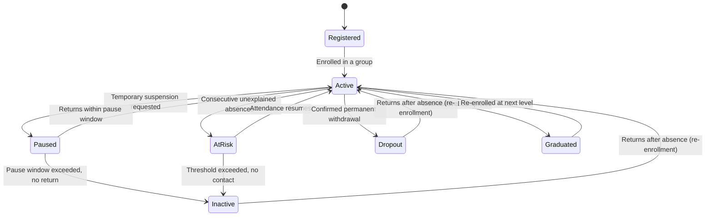
```mermaid
stateDiagram-v2
    [*] --> Registered
    Registered --> Active : Enrolled in a group
    Active --> Paused : Temporary suspension requested
    Paused --> Active : Returns within pause window
    Paused --> Inactive : Pause window exceeded, no return
    Active --> AtRisk : Consecutive unexplained absences
    AtRisk --> Active : Attendance resumes
    AtRisk --> Inactive : Threshold exceeded, no contact
    Inactive --> Active : Returns after absence (re-enrollment)
    Active --> Dropout : Confirmed permanent withdrawal
    Active --> Graduated : Course/level completed
    Graduated --> Active : Re-enrolled at next level
    Dropout --> Active : Returns after absence (re-enrollment)
```

### 5.2 Enrollment Lifecycle

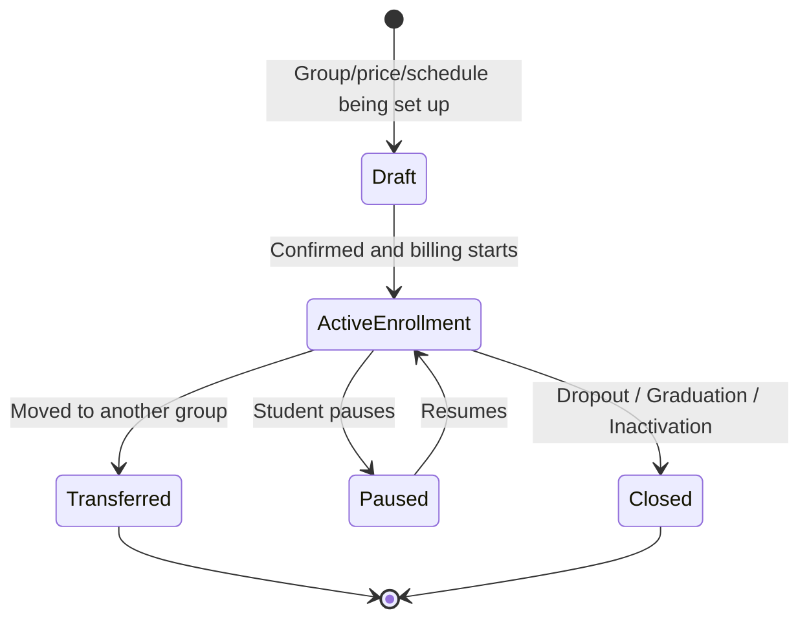
```mermaid
stateDiagram-v2
    [*] --> Draft : Group/price/schedule being set up
    Draft --> ActiveEnrollment : Confirmed and billing starts
    ActiveEnrollment --> Transferred : Moved to another group
    ActiveEnrollment --> Paused : Student pauses
    Paused --> ActiveEnrollment : Resumes
    ActiveEnrollment --> Closed : Dropout / Graduation / Inactivation
    Transferred --> [*]
    Closed --> [*]
```

### 5.3 Group Lifecycle

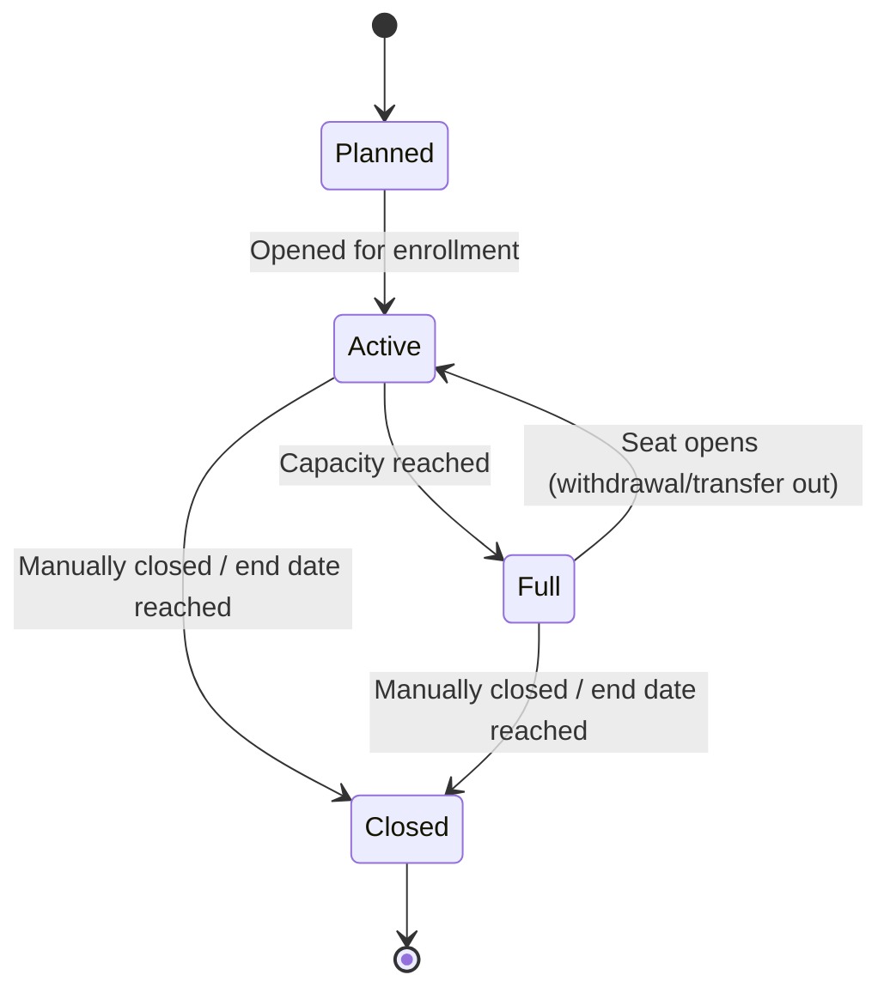
```mermaid
stateDiagram-v2
    [*] --> Planned
    Planned --> Active : Opened for enrollment
    Active --> Full : Capacity reached
    Full --> Active : Seat opens (withdrawal/transfer out)
    Active --> Closed : Manually closed / end date reached
    Full --> Closed : Manually closed / end date reached
    Closed --> [*]
```

### 5.4 Session Lifecycle

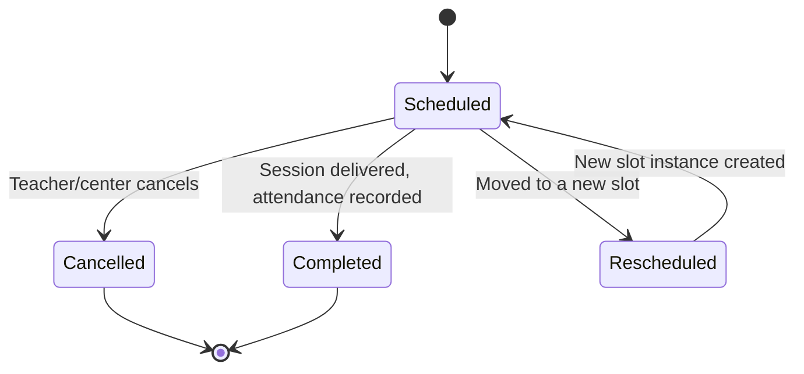
```mermaid
stateDiagram-v2
    [*] --> Scheduled
    Scheduled --> Completed : Session delivered, attendance recorded
    Scheduled --> Cancelled : Teacher/center cancels
    Scheduled --> Rescheduled : Moved to a new slot
    Rescheduled --> Scheduled : New slot instance created
    Cancelled --> [*]
    Completed --> [*]
```

### 5.5 Attendance Lifecycle

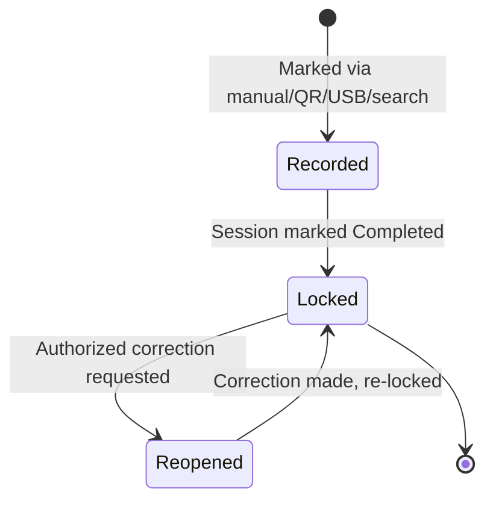
```mermaid
stateDiagram-v2
    [*] --> Recorded : Marked via manual/QR/USB/search
    Recorded --> Locked : Session marked Completed
    Locked --> Reopened : Authorized correction requested
    Reopened --> Locked : Correction made, re-locked
    Locked --> [*]
```

### 5.6 Invoice Lifecycle

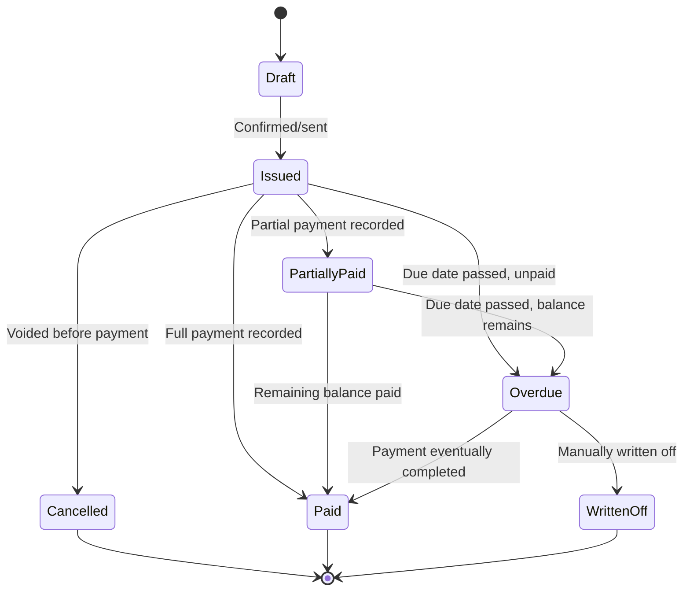
```mermaid
stateDiagram-v2
    [*] --> Draft
    Draft --> Issued : Confirmed/sent
    Issued --> PartiallyPaid : Partial payment recorded
    Issued --> Paid : Full payment recorded
    PartiallyPaid --> Paid : Remaining balance paid
    Issued --> Overdue : Due date passed, unpaid
    PartiallyPaid --> Overdue : Due date passed, balance remains
    Overdue --> Paid : Payment eventually completed
    Issued --> Cancelled : Voided before payment
    Overdue --> WrittenOff : Manually written off
    Cancelled --> [*]
    Paid --> [*]
    WrittenOff --> [*]
```

### 5.7 Payment Lifecycle

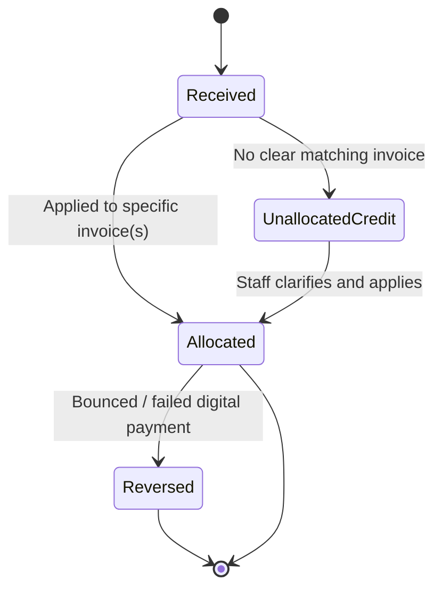
```mermaid
stateDiagram-v2
    [*] --> Received
    Received --> Allocated : Applied to specific invoice(s)
    Received --> UnallocatedCredit : No clear matching invoice
    UnallocatedCredit --> Allocated : Staff clarifies and applies
    Allocated --> Reversed : Bounced / failed digital payment
    Reversed --> [*]
    Allocated --> [*]
```

### 5.8 Expense Lifecycle

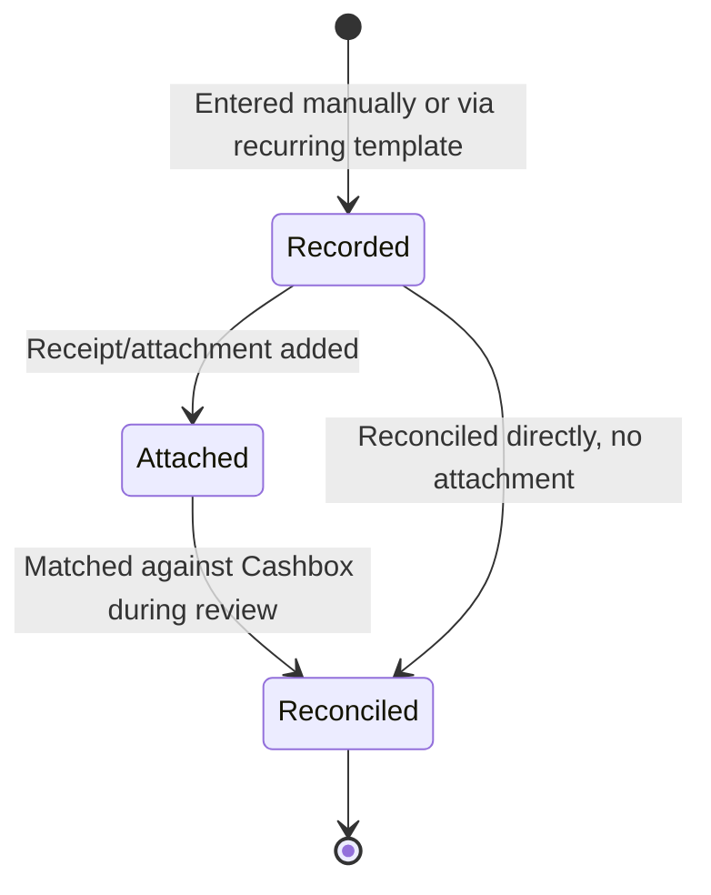
```mermaid
stateDiagram-v2
    [*] --> Recorded : Entered manually or via recurring template
    Recorded --> Attached : Receipt/attachment added
    Attached --> Reconciled : Matched against Cashbox during review
    Recorded --> Reconciled : Reconciled directly, no attachment
    Reconciled --> [*]
```

### 5.9 Notification Lifecycle

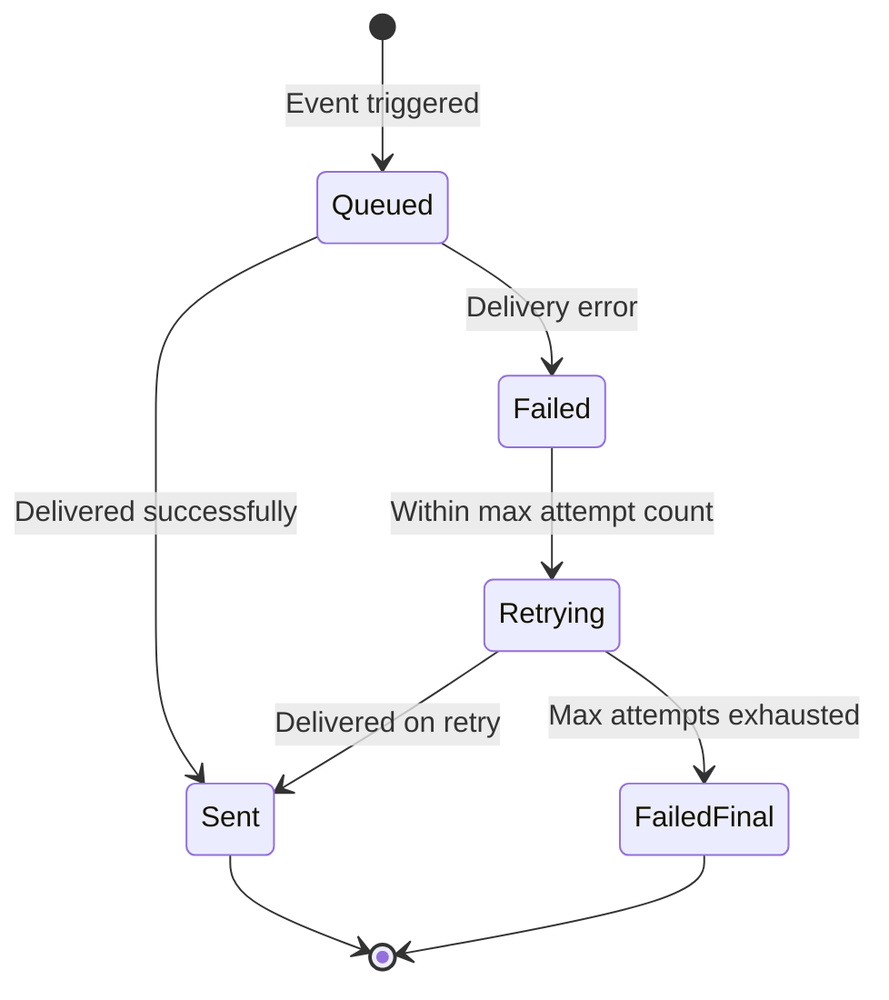
```mermaid
stateDiagram-v2
    [*] --> Queued : Event triggered
    Queued --> Sent : Delivered successfully
    Queued --> Failed : Delivery error
    Failed --> Retrying : Within max attempt count
    Retrying --> Sent : Delivered on retry
    Retrying --> FailedFinal : Max attempts exhausted
    Sent --> [*]
    FailedFinal --> [*]
```

---

## 6. Workflow Diagrams

These flowcharts describe the operational sequence of key business processes end to end, independent of who performs each step or which screen it happens on.

### 6.1 Student Registration

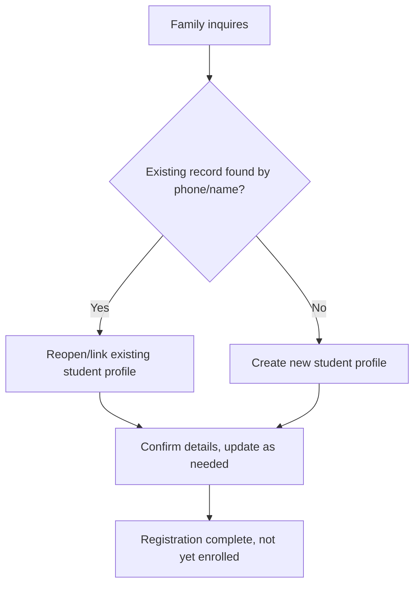
```mermaid
flowchart TD
    A[Family inquires] --> B{Existing record found by phone/name?}
    B -- Yes --> C[Reopen/link existing student profile]
    B -- No --> D[Create new student profile]
    C --> E[Confirm details, update as needed]
    D --> E
    E --> F[Registration complete, not yet enrolled]
```

### 6.2 Enrollment

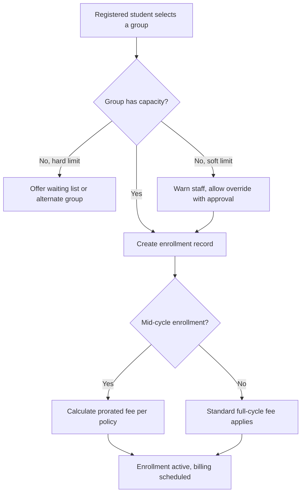
```mermaid
flowchart TD
    A[Registered student selects a group] --> B{Group has capacity?}
    B -- No, hard limit --> C[Offer waiting list or alternate group]
    B -- No, soft limit --> D[Warn staff, allow override with approval]
    B -- Yes --> E[Create enrollment record]
    D --> E
    E --> F{Mid-cycle enrollment?}
    F -- Yes --> G[Calculate prorated fee per policy]
    F -- No --> H[Standard full-cycle fee applies]
    G --> I[Enrollment active, billing scheduled]
    H --> I
```

### 6.3 Attendance

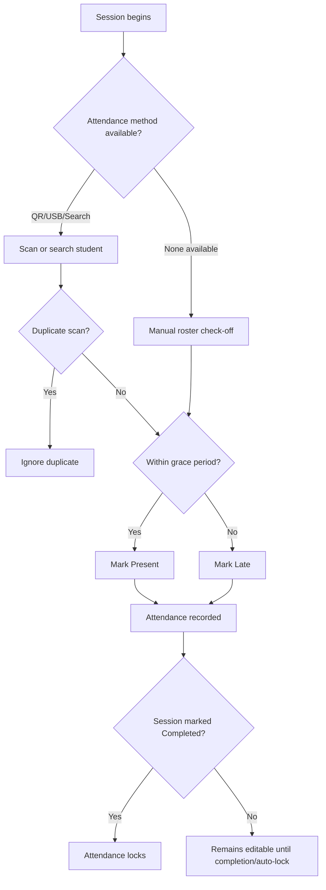
```mermaid
flowchart TD
    A[Session begins] --> B{Attendance method available?}
    B -- QR/USB/Search --> C[Scan or search student]
    B -- None available --> D[Manual roster check-off]
    C --> E{Duplicate scan?}
    E -- Yes --> F[Ignore duplicate]
    E -- No --> G{Within grace period?}
    D --> G
    G -- Yes --> H[Mark Present]
    G -- No --> I[Mark Late]
    H --> J[Attendance recorded]
    I --> J
    J --> K{Session marked Completed?}
    K -- Yes --> L[Attendance locks]
    K -- No --> M[Remains editable until completion/auto-lock]
```

### 6.4 Billing (Monthly Cycle)

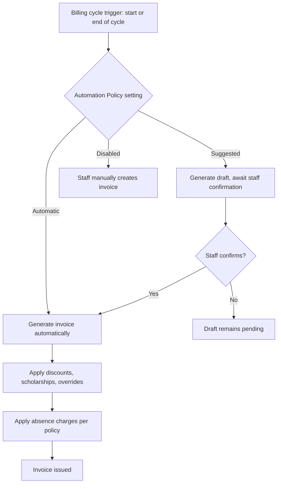
```mermaid
flowchart TD
    A[Billing cycle trigger: start or end of cycle] --> B{Automation Policy setting}
    B -- Automatic --> C[Generate invoice automatically]
    B -- Suggested --> D[Generate draft, await staff confirmation]
    B -- Disabled --> E[Staff manually creates invoice]
    D --> F{Staff confirms?}
    F -- Yes --> C
    F -- No --> G[Draft remains pending]
    C --> H[Apply discounts, scholarships, overrides]
    H --> I[Apply absence charges per policy]
    I --> J[Invoice issued]
```

### 6.5 Invoice Generation Detail

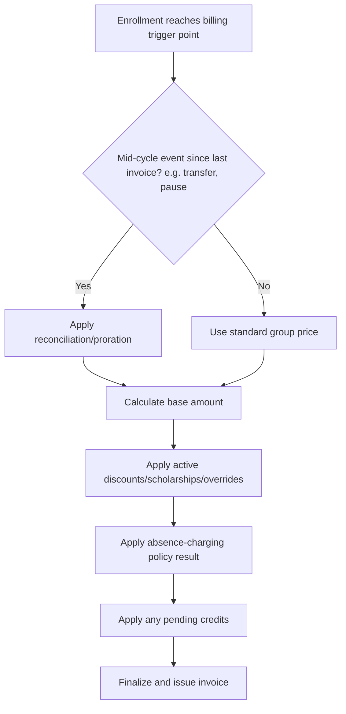
```mermaid
flowchart TD
    A[Enrollment reaches billing trigger point] --> B{Mid-cycle event since last invoice? e.g. transfer, pause}
    B -- Yes --> C[Apply reconciliation/proration]
    B -- No --> D[Use standard group price]
    C --> E[Calculate base amount]
    D --> E
    E --> F[Apply active discounts/scholarships/overrides]
    F --> G[Apply absence-charging policy result]
    G --> H[Apply any pending credits]
    H --> I[Finalize and issue invoice]
```

### 6.6 Payment Collection

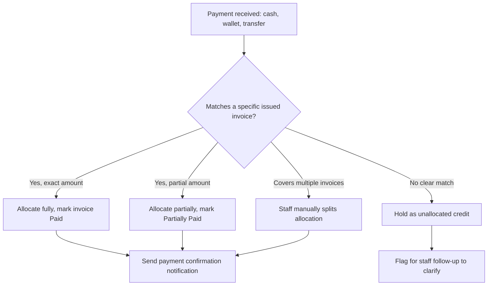
```mermaid
flowchart TD
    A[Payment received: cash, wallet, transfer] --> B{Matches a specific issued invoice?}
    B -- Yes, exact amount --> C[Allocate fully, mark invoice Paid]
    B -- Yes, partial amount --> D[Allocate partially, mark Partially Paid]
    B -- Covers multiple invoices --> E[Staff manually splits allocation]
    B -- No clear match --> F[Hold as unallocated credit]
    C --> G[Send payment confirmation notification]
    D --> G
    E --> G
    F --> H[Flag for staff follow-up to clarify]
```

### 6.7 Teacher Cancellation

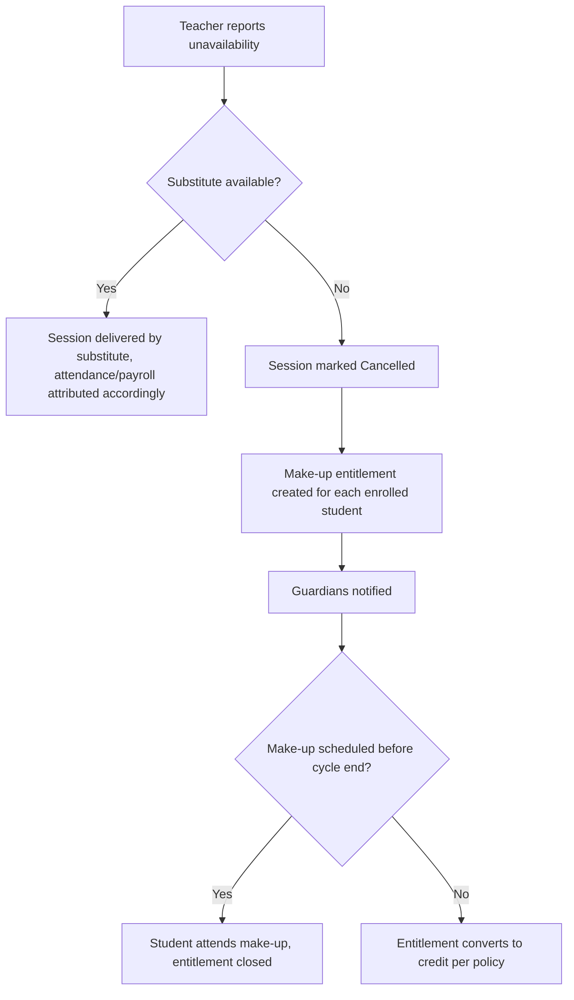
```mermaid
flowchart TD
    A[Teacher reports unavailability] --> B{Substitute available?}
    B -- Yes --> C[Session delivered by substitute, attendance/payroll attributed accordingly]
    B -- No --> D[Session marked Cancelled]
    D --> E[Make-up entitlement created for each enrolled student]
    E --> F[Guardians notified]
    F --> G{Make-up scheduled before cycle end?}
    G -- Yes --> H[Student attends make-up, entitlement closed]
    G -- No --> I[Entitlement converts to credit per policy]
```

### 6.8 Transfer

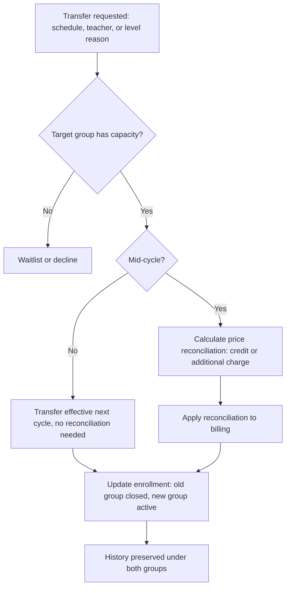
```mermaid
flowchart TD
    A[Transfer requested: schedule, teacher, or level reason] --> B{Target group has capacity?}
    B -- No --> C[Waitlist or decline]
    B -- Yes --> D{Mid-cycle?}
    D -- No --> E[Transfer effective next cycle, no reconciliation needed]
    D -- Yes --> F[Calculate price reconciliation: credit or additional charge]
    F --> G[Apply reconciliation to billing]
    E --> H[Update enrollment: old group closed, new group active]
    G --> H
    H --> I[History preserved under both groups]
```

### 6.9 Pause

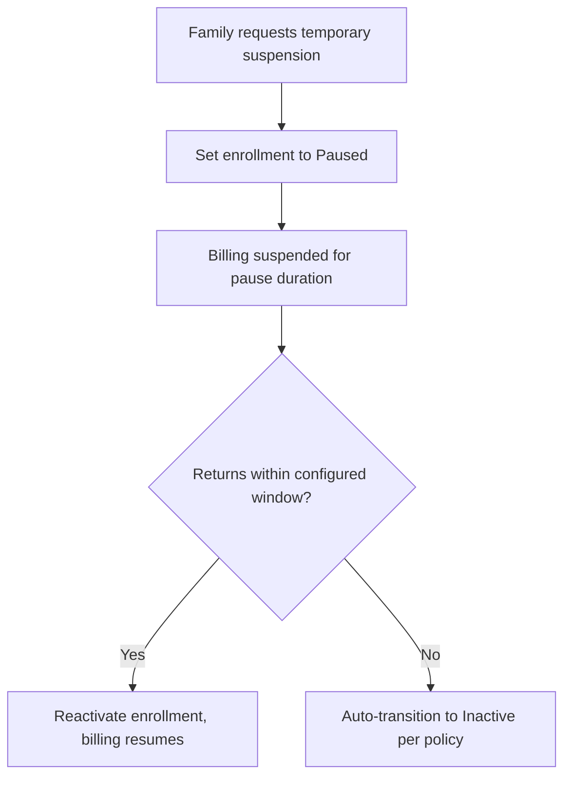
```mermaid
flowchart TD
    A[Family requests temporary suspension] --> B[Set enrollment to Paused]
    B --> C[Billing suspended for pause duration]
    C --> D{Returns within configured window?}
    D -- Yes --> E[Reactivate enrollment, billing resumes]
    D -- No --> F[Auto-transition to Inactive per policy]
```

### 6.10 Return After Absence

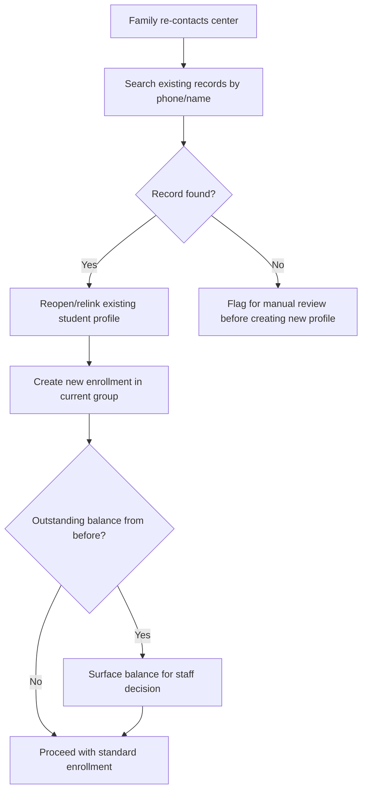
```mermaid
flowchart TD
    A[Family re-contacts center] --> B[Search existing records by phone/name]
    B --> C{Record found?}
    C -- Yes --> D[Reopen/relink existing student profile]
    C -- No --> E[Flag for manual review before creating new profile]
    D --> F[Create new enrollment in current group]
    F --> G{Outstanding balance from before?}
    G -- Yes --> H[Surface balance for staff decision]
    G -- No --> I[Proceed with standard enrollment]
    H --> I
```

### 6.11 Notifications

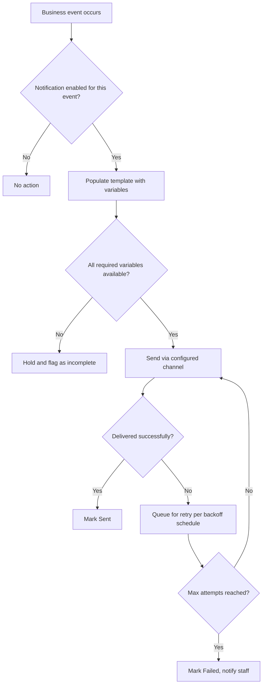
```mermaid
flowchart TD
    A[Business event occurs] --> B{Notification enabled for this event?}
    B -- No --> C[No action]
    B -- Yes --> D[Populate template with variables]
    D --> E{All required variables available?}
    E -- No --> F[Hold and flag as incomplete]
    E -- Yes --> G[Send via configured channel]
    G --> H{Delivered successfully?}
    H -- Yes --> I[Mark Sent]
    H -- No --> J[Queue for retry per backoff schedule]
    J --> K{Max attempts reached?}
    K -- No --> G
    K -- Yes --> L[Mark Failed, notify staff]
```

### 6.12 Backup (Operational Practice)

```mermaid
flowchart TD
    A[Regular operations: attendance, billing, payments recorded] --> B[Automated backup runs on schedule]
    B --> C{Incident occurs: device loss, data issue}
    C -- Yes --> D[Restore from most recent backup]
    D --> E{Gap between last backup and incident?}
    E -- Yes --> F[Reconstruct gap from paper fallback / staff recollection]
    E -- No --> G[Full recovery, no gap]
    F --> G
    C -- No --> H[Normal operation continues]
```

---

## 7. Financial Calculation Examples

All figures below use illustrative EGP amounts consistent with typical Egyptian tutoring pricing, purely to make the calculation logic concrete.

### 7.1 Monthly Billing (Calendar Month)

A group is priced at **900 EGP/month**, billed on a calendar-month basis. A student enrolled from the start of the month owes exactly 900 EGP regardless of whether the month has 4 or 5 scheduled sessions.

### 7.2 Session Billing

A group is priced at **120 EGP/session**. In a month with 5 scheduled sessions, a student who attends all 5 and has no cancellations owes: 5 × 120 = **600 EGP**. If 1 session was Cancelled by the teacher, it's excluded from billing: 4 × 120 = **480 EGP**.

### 7.3 Prorated Billing (Mid-Cycle Enrollment)

Group price: **800 EGP/month**, calendar-month billing, 30-day month. A student enrolls on day 21 (10 days remaining):
Prorated amount = 800 × (10 ÷ 30) = 800 × 0.333 = **266.67 EGP**, typically rounded to **267 EGP** per the center's rounding rule.

### 7.4 Prorated Billing (Session-Count Month)

Group price: **1,000 EGP** for an 8-session cycle (125 EGP/session-equivalent). A student enrolls after 3 sessions have already occurred, leaving 5 remaining:
Prorated amount = 125 × 5 = **625 EGP**.

### 7.5 Discount Calculation (Flat Amount)

Standard price: **700 EGP/month**. A flat discount of **100 EGP** is applied (e.g., a loyalty gesture):
Final invoice = 700 − 100 = **600 EGP**.

### 7.6 Discount Calculation (Percentage)

Standard price: **1,200 EGP/month**. A **15% discount** applies (e.g., a multi-subject bundle, per ETBS-092):
Discount amount = 1,200 × 0.15 = **180 EGP**.
Final invoice = 1,200 − 180 = **1,020 EGP**.

### 7.7 Scholarship Calculation (Structural Override)

Standard group price: **950 EGP/month**. A student holds a **50% scholarship**, applied automatically every cycle:
Every future invoice for this student = 950 × 0.50 = **475 EGP**, without staff re-entering the discount each month.

### 7.8 Scholarship + Discount Stacking (Order Matters — see BRS Open Question 16.5)

Standard price: **1,000 EGP/month**. Student has a **30% scholarship** and a separate **50 EGP flat loyalty discount**.

*If scholarship applied first:*
1,000 × (1 − 0.30) = 700 → 700 − 50 = **650 EGP**.

*If flat discount applied first:*
1,000 − 50 = 950 → 950 × (1 − 0.30) = **665 EGP**.

The 15 EGP difference between these two orderings is exactly why BRS Open Question 16.5 flags that the calculation order must be explicitly decided and applied consistently, not left ambiguous.

### 7.9 Transfer Adjustment (Mid-Cycle, Price Increase)

Student is on Group A at **800 EGP/month** (calendar-month, 30-day month), already paid in full for the current cycle. Transfers to Group B at **1,000 EGP/month** on day 16 (15 days remaining in the cycle).

Value already paid for remaining 15 days under Group A's price = 800 × (15 ÷ 30) = **400 EGP**.
Value owed for remaining 15 days under Group B's price = 1,000 × (15 ÷ 30) = **500 EGP**.
Additional charge due = 500 − 400 = **100 EGP**.

### 7.10 Transfer Adjustment (Mid-Cycle, Price Decrease)

Same scenario, but transferring from Group B (1,000 EGP) to Group A (800 EGP) on day 16 of 30, having already paid in full for Group B:

Value already paid for remaining 15 days under Group B's price = 1,000 × (15 ÷ 30) = **500 EGP**.
Value owed for remaining 15 days under Group A's price = 800 × (15 ÷ 30) = **400 EGP**.
Credit due to student = 500 − 400 = **100 EGP** (applied as a credit toward the next invoice, per BRS Section 8.7).

### 7.11 Partial Payment

Invoice total: **900 EGP**. Parent pays **500 EGP** at the start of the month.
Invoice status: Partially Paid.
Remaining balance tracked: 900 − 500 = **400 EGP**, due per the center's late-payment policy.

### 7.12 Credit From Overpayment

Invoice total: **800 EGP**. Parent pays **1,000 EGP** by mistake (miscounted cash).
Invoice marked Paid (800 EGP allocated); remaining **200 EGP** recorded as a Credit.
Next month's invoice of 850 EGP (assume a different group price) is reduced by the credit: 850 − 200 = **650 EGP** due.

### 7.13 Refund

A family withdraws immediately after paying a **1,200 EGP** course fee, before any session has occurred, and the center's policy for this case is a full refund.
Refund issued: **1,200 EGP**, linked to the original payment record, reducing recognized revenue for the period in financial reporting.

### 7.14 Outstanding Balance (Aggregate)

A center has the following unpaid/partially-paid invoices at month end:
- Student A: Issued, unpaid — 900 EGP
- Student B: Partially Paid — 400 EGP remaining of 900 EGP
- Student C: Overdue — 1,000 EGP

Total Outstanding Balance = 900 + 400 + 1,000 = **2,300 EGP**.

### 7.15 Cashbox Reconciliation

Starting cashbox balance: **3,000 EGP**.
Cash payments received during the day: +1,800 EGP (three families paying 600 EGP each).
Cash expenses paid during the day: −250 EGP (printing supplies).
Expected end-of-day cashbox balance = 3,000 + 1,800 − 250 = **4,550 EGP**.
If the physical count at closing is **4,500 EGP**, there is a **50 EGP shortage** requiring investigation (per ETBS-063).

---

## 8. Edge Case Library

This library collects unusual-but-real cases in a single, quickly scannable reference, distinct from the narrative scenarios in Section 3. Many reference the fuller scenario they originate from.

| # | Edge Case | Reference | Key Consideration |
|---|---|---|---|
| 1 | Student disappears for months with no communication | ETBS-076 | Outstanding balance must remain visible, never silently written off |
| 2 | Teacher forgets to mark attendance for an entire session | ETBS-046 | Needs an auto-completion fallback to avoid indefinitely unlocked records |
| 3 | Student scans attendance twice for the same session | ETBS-042 | Second scan ignored, optionally logged for anomaly detection |
| 4 | Payment received after an invoice has already been closed/written off | — | Reopens as a late recovery; recorded as a payment against a written-off invoice, not a new unrelated income entry |
| 5 | Prices change while a student has an active, ongoing enrollment | ETBS-077 | New price applies only from the next cycle; never retroactive |
| 6 | Staff attempts to delete a group that has enrolled students | ETBS-078 | Must be blocked in favor of Archive |
| 7 | Billing policy changes after historical invoices already exist | ETBS-079 | Historical invoices remain under the old policy; changes are forward-dated only |
| 8 | Two students share a guardian phone number | STU-001 (BRS) | Warn, don't block, since siblings commonly share a contact |
| 9 | A returning student's old profile isn't found, leading to accidental duplication | ETBS-008 | "Search before create" must be a prominent step in registration |
| 10 | A discount is applied informally by a teacher without recorded reasoning | ETBS-016 | Approval thresholds and mandatory reason fields exist specifically to catch this |
| 11 | A student attends a group they aren't formally enrolled in, informally | ETBS-026 | Should be recordable without disrupting their primary enrollment |
| 12 | A lost attendance card is reused by someone else before deactivation | ETBS-044 | A real, if narrow, security gap tutors should be aware of |
| 13 | A scanned QR code is suspected of being shared/copied for proxy attendance | ETBS-043 | System can only flag anomalies; cannot fully prevent without stronger identity verification |
| 14 | A family disputes an absence charge weeks after the fact | ETBS-080 | The audit trail, not memory, must be the basis for resolution |
| 15 | A cash shortage in the cashbox has no identifiable source | ETBS-063 | A materiality threshold for "investigate vs. accept and log" is a practical necessity |
| 16 | A payment is received with no reference to which student/invoice it covers | ETBS-060 | Held as unallocated credit, never guessed |
| 17 | Two guardians disagree over billing responsibility | ETBS-085 | A single designated primary billing contact avoids most of this friction |
| 18 | A group's stated capacity is repeatedly overridden | ETBS-012 | Signals the stated capacity itself may need revisiting |
| 19 | A student's mid-cycle transfer involves a lower-priced destination group | ETBS-009 | The credit due may be deliberately waived as goodwill — must be supported, not forced |
| 20 | Historical paper records need to be digitized into the system after the fact | ETBS-105 | Must accommodate coarser precision without demanding modern-data-entry rigor retroactively |
| 21 | A make-up entitlement is never used and the cycle closes | BIL-002 (BRS) | Converts to credit by default rather than silently disappearing |
| 22 | A student enrolled in two billing models simultaneously (e.g., one subject monthly, one per-session) | ETBS-093 | Must produce clearly separated line items, never a blended, confusing single charge |
| 23 | An extended, business-altering closure occurs (e.g., a COVID-style event) | ETBS-074 | The system's existing configurability should be sufficient without emergency development |
| 24 | A sponsor/corporate payer stops paying mid-year | ETBS-065 | Billing must revert cleanly to the family without disrupting the student's enrollment |
| 25 | An at-risk automation fires during a known, business-wide low-attendance period (e.g., school exam week) | ETBS-072 | Should be suppressible for a defined period to avoid false alarms |

---

## 9. Egyptian Market Best Practices

### 9.1 Cash Is Still King, But Not Forever

Despite the growth of mobile wallets and bank transfers, cash remains the dominant payment method across most of the Egyptian tutoring market, especially outside Cairo and Alexandria. A system that assumes digital payment as the default, with cash as an afterthought, will feel foreign to a large share of its potential users. The reverse — cash-first, digital as an increasingly important option — better matches reality today, while the balance is clearly shifting toward digital over time, especially among younger, urban tutors.

### 9.2 Trust-Based Relationships Often Override "The Rules"

Many tutors — especially private tutors and smaller centers — operate on long-standing personal trust with families they've known for years. This shows up constantly in this document: goodwill discounts, waived transfer credits, continued attendance despite a late payment, informal re-enrollment without repeating a registration fee. A system that treats every deviation from the "standard" price or policy as an error to be corrected will actively fight against how these businesses build loyalty. The right posture is to make deviations easy, visible, and accountable — never to eliminate them.

### 9.3 Different Tutors, Genuinely Different Businesses

A single private tutor teaching from a spare room and a 10-teacher center with a dedicated reception desk are not the same business wearing different clothes — they have different risk tolerances, different staffing realities, and different ideas of what "good enough" record-keeping looks like. This document deliberately does not recommend one universal workflow. Where scenarios diverge (e.g., ETBS-001's proration question, or automation confirmation levels throughout), the right answer is genuinely "it depends on the business," and the software's job is to make each choice available, not to pick a winner.

### 9.4 The Assistant, Not the Teacher, Often Runs the System

It's a common mistake to design a tutoring platform around the teacher as the primary user. In practice, especially in centers, a non-teaching assistant handles attendance and cash collection far more often than the teacher does. Whoever designs the workflows in the BRS and PRD should keep this person specifically in mind — not just the owner and not just the teacher.

### 9.5 The Monthly Fee Culture Runs Deep

Charging a flat monthly fee "per subject per student," largely independent of the exact number of sessions in a given month, isn't just a pricing convenience — it's a deeply expected cultural norm among Egyptian families. A family that suddenly receives a bill that varies month to month based on session count, without having agreed to that model upfront, may perceive it as unfair or confusing, even if it's mathematically more "precise." Precision is not automatically the more customer-friendly choice here.

### 9.6 Seasonal Rhythms Are Not Edge Cases — They're the Calendar

Ramadan schedule shifts, exam-season disruptions, Thanaweya Amma's rigid calendar, and summer course offerings aren't rare exceptions to plan for defensively — they are a predictable, recurring part of the yearly operating rhythm for almost every tutoring business in Egypt. A system that treats these as one-off manual workarounds every year, rather than supportable, repeatable patterns, will create real annual friction.

### 9.7 Word-of-Mouth and Family Networks Drive Growth

Referrals, sibling enrollments, and reputation within a specific school or neighborhood are typically a tutoring business's primary growth engine — far more than any formal marketing. The system's support for tracking referrals (ETBS-056), sibling billing (ETBS-013), and family relationships (BRS Section 4.10) directly supports how these businesses actually grow, not just how they operate day to day.

### 9.8 Never Force a Single Workflow Where the Business Genuinely Varies

The recurring theme across this entire document is intentional: wherever a real scenario showed two or more genuinely different, equally legitimate ways a tutor might handle it, this document documents both rather than declaring one "correct." The BRS's configuration-over-hardcoding philosophy (Section 2.3) exists specifically because this market does not have one universal way of doing business — and a platform that assumes otherwise will fit fewer businesses than one that doesn't.

---

## 10. Future Ideas

These are ideas worth remembering but deliberately out of scope for the current version of the BRS/PRD. They are recorded here so they aren't lost, and so future versions of this document can revisit them with real usage data in hand.

- **Trial-to-paid conversion tracking** — measuring how often free/trial sessions (ETBS-023) convert into paying enrollments, as a marketing-effectiveness signal.
- **Referral-source reporting** — understanding which referring families/channels actually drive the most durable enrollments (ETBS-056).
- **Formal installment-plan modeling** — treating multi-month payment plans (ETBS-058) as a first-class billing construct rather than a sequence of manual partial payments.
- **Formal salary-advance tracking** — a dedicated payroll-advance feature rather than a generic financial adjustment (ETBS-064).
- **A pre-loaded Egyptian public holiday calendar** — reducing the manual effort of bulk-cancelling sessions around known national/religious holidays (ETBS-066).
- **Grade-level or group-level "bulk pause"** — directly supporting the Thanaweya Amma exam-period pattern (ETBS-071) without treating every student as individually paused.
- **Temporary suppression of at-risk automation** — during known, business-wide low-attendance periods like school exam weeks (ETBS-072), to avoid false alarms.
- **A distinct "online" session/group delivery type** — for centers that adopt remote delivery more than occasionally (ETBS-091), beyond simply marking manual attendance for a remote attendee.
- **Formal multi-branch reporting rollups** — richer consolidated views as a center genuinely scales to multiple locations (ETBS-097, ETBS-104).
- **Template/franchise-configuration tooling** — letting an owner clone a proven policy configuration into a new branch or franchised location in one step (ETBS-099).
- **A guided historical-data-import workflow** — specifically easing the transition for long-standing businesses digitizing years of paper records (ETBS-105).
- **Stronger identity-verifying attendance hardware integration** — as a more robust deterrent against proxy attendance (ETBS-043) than QR/USB scanning alone can offer.
- **A parent-facing self-service progress view** — reducing repetitive staff time spent on individual progress-report requests (ETBS-086).
- **An optional, access-restricted complaint/incident log** — distinct from routine transfer-reason tracking, to surface real patterns in teacher-related concerns (ETBS-087).

---

*End of Egyptian Tutoring Business Scenarios (ETBS) v1.0. This document should be treated as a living reference — consulted before writing or revising any rule in the Business Rules Specification, and updated whenever a genuinely new real-world scenario is encountered that isn't yet captured here.*
