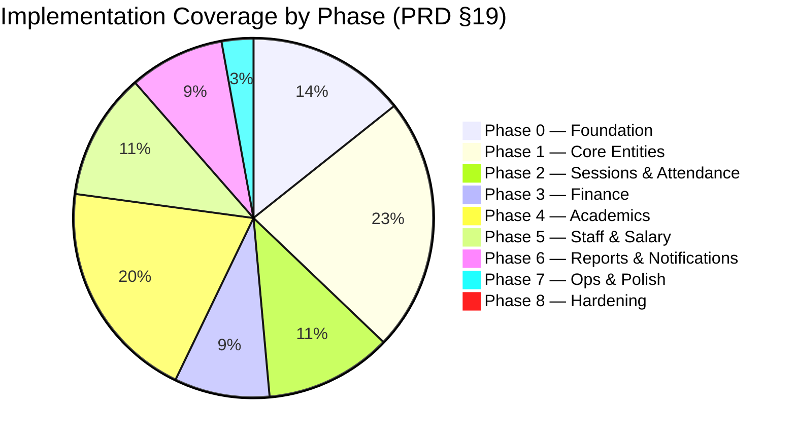

# Genius Center — Gap Analysis: Documentation vs. Implementation

## Executive Summary

The current codebase is a **functional UI prototype** — approximately **15–20% of the documented v1.0 scope** is implemented. It covers the frontend shell and basic CRUD for most modules, but lacks the entire backend architecture, data model integrity, business logic, and cross-cutting concerns that the PRD specifies as core v1.0 requirements.

> [!CAUTION]
> The implementation deviates from the PRD's architecture in fundamental ways. The PRD specifies a **Local API Server (Node.js + Hono) + Browser UI** pattern; the current code is a **browser-only SPA using Supabase (cloud) + Dexie (IndexedDB)** — the opposite of offline-first local SQLite.

---

## Architecture Gap — The Biggest Problem

| Aspect | PRD Specifies | Current Implementation |
|---|---|---|
| **Runtime** | Node.js + Hono local API server + Browser UI | Browser-only SPA, no server |
| **Database** | SQLite (local, WAL mode) via Prisma ORM | Supabase (cloud PostgreSQL) + Dexie (IndexedDB cache) |
| **Auth** | Local password + PIN, Argon2 hashing, no cloud | Supabase Auth (cloud-dependent) |
| **Data ownership** | All data on user's machine | Data stored on Supabase cloud servers |
| **Offline capability** | Full offline by default | Requires internet for auth & initial data |
| **Sync** | Deferred to post-v1.0 | Implemented as core (Supabase ↔ Dexie sync) |
| **Validation** | Zod schemas shared server ↔ client | No Zod, no shared schemas |
| **ORM** | Prisma | None — raw Dexie calls |
| **State management** | TanStack Query | None — raw useState/useEffect |

> [!IMPORTANT]
> **Decision Required:** The current Supabase + Dexie architecture contradicts the PRD's core principle: *"Offline is the default state, not a fallback."* You must decide:
> 1. **Option A — Rebuild per PRD:** Local Node.js + Hono server, Prisma + SQLite, browser UI via localhost. This is the documented path.
> 2. **Option B — Accept Supabase as backend:** Keep the current cloud architecture but acknowledge the PRD deviation and update docs. This makes v1.0 internet-dependent.
> 3. **Option C — Hybrid:** Keep Supabase for auth/sync but add a local server layer for business logic and SQLite for primary storage.

---

## Module-by-Module Gap Analysis

### ✅ = Implemented | ⚠️ = Partial | ❌ = Missing

### 1. App Shell & Navigation

| Feature | Status | Notes |
|---|---|---|
| RTL sidebar (right-anchored) | ✅ | Implemented in [AppShell.tsx](file:///d:/Course/project-bolt-sb1-47bmsvv7 (2)/project/src/components/AppShell.tsx) |
| Sidebar collapse/expand | ✅ | Working |
| `Ctrl+1..9` nav shortcuts | ⚠️ | `Ctrl+K` command palette partially wired, no `Ctrl+1..9` |
| Command palette (`Ctrl+K`) | ⚠️ | Basic dialog exists, but no full search/fuzzy matching |
| Global search (`Ctrl+F`) | ❌ | Not implemented |
| Quick-add (`Ctrl+N`) | ❌ | Not implemented |
| Notification bell | ❌ | Not in top bar |
| Bottom status bar (DB health, backup age, LAN QR status) | ❌ | Not implemented |
| Session lock / PIN unlock | ❌ | Not implemented |
| Top bar breadcrumbs | ❌ | Not implemented |

---

### 2. Student Management (PRD §8.1)

| Feature | Status | Notes |
|---|---|---|
| CRUD (create/read/update/delete) | ✅ | In [Students.tsx](file:///d:/Course/project-bolt-sb1-47bmsvv7 (2)/project/src/pages/Students.tsx) |
| Photo upload | ❌ | Field exists in type but no UI for upload |
| QR code auto-generation | ❌ | Field exists but no generation logic |
| QR student card printing | ❌ | Not implemented |
| Status lifecycle (Active→Paused/Graduated/Dropped→Archived) | ⚠️ | Basic status field, no lifecycle enforcement |
| Many-to-many parent linking | ❌ | Current model is `parent_id` (one-to-one), PRD requires `StudentParent` join table |
| Tags system | ⚠️ | Stored as string array, no UI for managing |
| Student profile with full history (attendance, payments, grades, homework) | ❌ | Detail view is basic, no tabbed history |
| Search/filter | ✅ | Name, status, grade filtering works |
| Medical notes | ⚠️ | Field exists in type, not sure if in form |

---

### 3. Parent Management (PRD §8.1)

| Feature | Status | Notes |
|---|---|---|
| CRUD | ✅ | In [Parents.tsx](file:///d:/Course/project-bolt-sb1-47bmsvv7 (2)/project/src/pages/Parents.tsx) |
| Many-to-many student linking | ❌ | Not implemented — PRD requires `StudentParent` join with `isPrimary` flag |
| Primary contact flag | ❌ | Not implemented |
| Relation type (father/mother/guardian) | ⚠️ | Field exists but no join table |

---

### 4. Group & Schedule Management (PRD §8.2)

| Feature | Status | Notes |
|---|---|---|
| CRUD | ✅ | In [Groups.tsx](file:///d:/Course/project-bolt-sb1-47bmsvv7 (2)/project/src/pages/Groups.tsx) |
| Subject/Teacher/Classroom linking | ✅ | Working |
| Weekly schedule (GroupSchedule model) | ⚠️ | Uses `schedule_days` array on Group instead of separate `GroupSchedule` table per PRD |
| Enrollment records with start/end/price override | ❌ | Basic `GroupEnrollment` exists but no price override, no proper lifecycle |
| Capacity enforcement | ❌ | Field exists, no enforcement logic |
| Pricing model (Monthly/Per-Session/Course/Custom) | ⚠️ | Payment type field exists, no pricing rule engine |

---

### 5. Class Sessions (PRD §8.2)

| Feature | Status | Notes |
|---|---|---|
| Basic session CRUD | ✅ | In [Sessions.tsx](file:///d:/Course/project-bolt-sb1-47bmsvv7 (2)/project/src/pages/Sessions.tsx) |
| Calendar view | ❌ | Not implemented |
| Recurring session generation | ❌ | Not implemented — PRD requires auto-generation from group schedules |
| Session status lifecycle (Scheduled→In Progress→Completed→Cancelled) | ⚠️ | Basic status field, no workflow |

---

### 6. Attendance (PRD §8.3) — Critical Module

| Feature | Status | Notes |
|---|---|---|
| Manual attendance grid | ✅ | Working in [Attendance.tsx](file:///d:/Course/project-bolt-sb1-47bmsvv7 (2)/project/src/pages/Attendance.tsx) |
| Keyboard shortcuts (P/A/L/E + arrow keys) | ❌ | Not implemented |
| Search-based attendance | ❌ | Not implemented |
| QR — Mobile (LAN) scanning | ❌ | Button exists, no implementation |
| QR — USB HID scanner | ❌ | Button exists, no implementation |
| Shared write path for all methods | ❌ | No `AttendanceService.mark()` — writes go directly to Dexie |
| Duplicate scan suppression | ❌ | Not implemented |
| Session-closed blocking | ❌ | Not implemented |
| Attendance method tracking | ❌ | No `method` field (MANUAL/SEARCH/QR_MOBILE/QR_USB) |

---

### 7. Homework & Exams (PRD §8.4)

| Feature | Status | Notes |
|---|---|---|
| Homework CRUD | ✅ | In [Education.tsx](file:///d:/Course/project-bolt-sb1-47bmsvv7 (2)/project/src/pages/Education.tsx) |
| Per-student submission tracking | ⚠️ | Basic status tracking |
| Exam CRUD | ✅ | Working |
| Grade entry & ranking | ✅ | Basic implementation |
| Pass-rate statistics | ❌ | Not implemented |
| Gradebook per student/subject/term | ❌ | Not implemented |

---

### 8. Payments & Finance (PRD §8.5) — Critical Module

| Feature | Status | Notes |
|---|---|---|
| Payment CRUD | ✅ | In [Payments.tsx](file:///d:/Course/project-bolt-sb1-47bmsvv7 (2)/project/src/pages/Payments.tsx) |
| **Invoice model** | ❌ | **Completely missing.** PRD requires Invoice → Payment → PaymentAllocation 3-table model. Current code has only a flat `Payment` table. |
| **Invoice line items** | ❌ | Not implemented |
| **Payment allocations (split across invoices)** | ❌ | Not implemented |
| **Partial payments** | ❌ | Status field exists but no allocation logic |
| **Overpayment-as-credit** | ❌ | Not implemented |
| **Refunds** (negative payment with reason + permission gate) | ❌ | Not implemented |
| **Money as integer minor units** | ❌ | **Current code uses floats** (`amount: number`) — PRD explicitly forbids this |
| Receipt numbering | ⚠️ | Field exists, no auto-generation |
| Receipt PDF printing/export | ❌ | Not implemented |
| Income & Expense tracking | ✅ | In [Finance.tsx](file:///d:/Course/project-bolt-sb1-47bmsvv7 (2)/project/src/pages/Finance.tsx) |
| Expense categories | ✅ | Working |
| Cash-flow view | ⚠️ | Basic overview with totals, not a proper cash-flow view |
| Overdue payment detection | ❌ | No background job or automation |

---

### 9. Staff & Roles (PRD §8.6)

| Feature | Status | Notes |
|---|---|---|
| Staff CRUD | ✅ | In [Staff.tsx](file:///d:/Course/project-bolt-sb1-47bmsvv7 (2)/project/src/pages/Staff.tsx) |
| Role-based permissions | ⚠️ | Basic role→permission mapping in [auth.tsx](file:///d:/Course/project-bolt-sb1-47bmsvv7 (2)/project/src/lib/auth.tsx), but not the full `Role → RolePermission → Permission` model |
| Custom roles with per-permission overrides | ⚠️ | `مخصص` role exists with custom permissions, no UI to edit permission sets |
| Salary rules (Fixed/Per-Session/Per-Hour/Commission) | ⚠️ | Basic salary tracking, no rule engine |
| Salary payouts with payslip PDF | ❌ | Not implemented |

---

### 10. Reports (PRD §8.7)

| Feature | Status | Notes |
|---|---|---|
| Report generation | ✅ | In [Reports.tsx](file:///d:/Course/project-bolt-sb1-47bmsvv7 (2)/project/src/pages/Reports.tsx) |
| All 8 report types | ✅ | Student, Attendance, Payment, Financial, Group, Exam, Homework, Staff |
| Date range filtering | ❌ | Not implemented |
| **PDF export** | ❌ | Not implemented |
| **Excel (.xlsx) export** | ❌ | Not implemented |
| **CSV export** | ❌ | Not implemented |
| Charts (Recharts) | ❌ | **Recharts not installed.** No charts anywhere in the app |

---

### 11. Notifications (PRD §8.8)

| Feature | Status | Notes |
|---|---|---|
| Template management | ⚠️ | Basic UI exists |
| Variable injection (`{StudentName}`) | ❌ | Not implemented |
| Channel adapter pattern | ❌ | Not implemented |
| Send logging | ⚠️ | Basic notification log |
| Preview before sending | ❌ | Not implemented |
| Automatic triggers (overdue payment) | ❌ | Not implemented |

---

### 12. Settings, Backup & Audit (PRD §8.9)

| Feature | Status | Notes |
|---|---|---|
| Business profile settings | ✅ | In [Settings.tsx](file:///d:/Course/project-bolt-sb1-47bmsvv7 (2)/project/src/pages/Settings.tsx) |
| Logo upload | ❌ | Not implemented |
| **Backup (one-click SQLite snapshot)** | ❌ | [Backup.tsx](file:///d:/Course/project-bolt-sb1-47bmsvv7 (2)/project/src/pages/Backup.tsx) exists but cannot work — no SQLite database to backup |
| **Restore with integrity validation** | ❌ | Not implemented |
| **Scheduled backups** | ❌ | Not implemented |
| Audit log viewer | ⚠️ | [AuditLog.tsx](file:///d:/Course/project-bolt-sb1-47bmsvv7 (2)/project/src/pages/AuditLog.tsx) exists, but no automatic audit logging on writes |
| **Repository-layer audit decorator** | ❌ | Not implemented — PRD requires automatic before/after JSON diff capture |
| Working hours configuration | ❌ | Not implemented |
| Backup schedule configuration | ❌ | Not implemented |

---

### 13. Cross-Cutting Concerns

| Feature | Status | Notes |
|---|---|---|
| **Zod validation schemas** | ❌ | Not installed, no validation anywhere |
| **TanStack Query** | ❌ | Not installed, all data fetching is raw `useState` + `useEffect` |
| **i18n key extraction** | ❌ | All Arabic strings are hardcoded in components |
| **Typed error hierarchy** | ❌ | No `DomainError`/`ValidationError`/etc. |
| **tenantId on all tables** | ❌ | Not implemented |
| **Soft deletes (deletedAt)** | ⚠️ | Dexie soft delete via `_sync_status: 'deleted'`, not the PRD's `deletedAt` field |
| **UUID primary keys** | ✅ | Implemented via `crypto.randomUUID()` |
| **Radix UI / Headless UI primitives** | ❌ | Not installed — custom UI components throughout |
| **ABC Diatype Arabic font** | ❌ | Font files exist in Docs but not loaded — using system defaults |
| **Rubik font** | ❌ | Not loaded in the app |
| **Design tokens per PRD §14.2** | ⚠️ | Tailwind config has custom tokens but not exactly matching the PRD's token set |
| **Testing (Vitest + Playwright)** | ❌ | No tests exist |
| **Keyboard shortcuts** | ⚠️ | `Ctrl+K` partially works, no others |

---

### 14. Data Model Compliance

| PRD Model | Implemented | Notes |
|---|---|---|
| `Tenant` | ❌ | No multi-tenant support |
| `User` + `Role` + `Permission` + join tables | ❌ | Flat `Staff` table with role string |
| `Student` (with `qrToken`, `tenantId`) | ⚠️ | Missing `qrToken`, `tenantId`, `code` |
| `StudentParent` (many-to-many join) | ❌ | Uses `parent_id` on Student |
| `GroupSchedule` (separate table) | ❌ | `schedule_days` array on Group |
| `Enrollment` (with price override) | ⚠️ | Basic without price override |
| `ClassSession` (named to avoid collision) | ✅ | Named `ClassSession` |
| `Invoice` + `InvoiceLine` + `PaymentAllocation` | ❌ | Not implemented at all |
| `SalaryRule` + `SalaryPayout` | ⚠️ | Flat `Salary` table |
| `AuditLog` (with before/after JSON) | ⚠️ | Type exists, no automatic population |
| `BackupRecord` | ❌ | Not implemented |
| Money as integer minor units | ❌ | Using floats |

---

## Quantified Coverage Summary

| PRD Phase | Estimated Completion | Key Gaps |
|---|---|---|
| **Phase 0 — Foundation** | ~25% | No Hono server, no Prisma, no SQLite, no Zod, no TanStack Query, no proper auth, no design tokens |
| **Phase 1 — Core Entities** | ~40% | CRUD exists for most entities but data model doesn't match PRD (no join tables, no invoices, no proper enrollment) |
| **Phase 2 — Sessions & Attendance** | ~20% | Manual attendance grid works; no QR, no calendar, no recurring sessions, no keyboard shortcuts |
| **Phase 3 — Finance** | ~15% | Basic income/expense tracking; no invoice model, no payment allocations, no PDF receipts, money is floats |
| **Phase 4 — Academics** | ~35% | Homework and exams have basic CRUD; no gradebook, no ranking stats, no pass-rate |
| **Phase 5 — Staff & Salary** | ~20% | Staff CRUD works; no proper RBAC model, no salary rules engine, no payslips |
| **Phase 6 — Reports & Notifications** | ~15% | Report types exist but no export (PDF/Excel/CSV), no charts, no notification adapter |
| **Phase 7 — Ops & Polish** | ~5% | Backup/audit pages exist as shells; no actual backup/restore functionality |
| **Phase 8 — Hardening** | 0% | No tests, no performance optimization, no RTL regression testing |

---

## Open Questions for You

> [!IMPORTANT]
> These decisions will fundamentally affect what we build next:

1. **Architecture Direction:** Do you want to keep the Supabase + Dexie approach (faster to iterate but cloud-dependent), or migrate to the PRD's local server architecture (correct per spec, but significant rebuild)?

2. **Priority Focus:** Which modules are most urgent for your real usage?
   - A) Fix the financial model (invoices, allocations, minor units) — correctness-critical
   - B) Complete attendance with QR scanning — daily-use critical
   - C) Add reports export (PDF/Excel) — business-value critical
   - D) Fix the data model to match PRD (join tables, tenantId) — architecture-critical

3. **Testing:** The PRD mandates a full test pyramid. Do you want to start adding tests now, or focus on feature completion first?

4. **Font & Design System:** The PRD specifies ABC Diatype Arabic (files exist in Docs) and specific design tokens. Should we apply the correct font and design system, or keep the current styling?

---

## Recommended Action Plan (Priority Order)

### 🔴 Critical (Fix Before Anything Else)

1. **Money representation** — Change all `amount: number` fields to integer minor units. This is a correctness issue; floats cause real financial bugs.

2. **Invoice/Payment/Allocation model** — The flat `Payment` table cannot support partial payments, split allocations, or refunds. This is the financial backbone.

3. **Parent ↔ Student join table** — The current `parent_id` on Student breaks the many-to-many requirement. A parent with 3 students enrolled can't be represented correctly.

### 🟡 High Priority (Core v1.0 Functionality)

4. **Add Zod validation** — Install Zod, create shared schemas for all entities. No data should reach the store unvalidated.

5. **Install TanStack Query** — Replace all `useState`/`useEffect` data-fetching with proper cache/mutation management.

6. **QR code generation & printing** — Implement QR token generation on student creation, student card PDF template.

7. **Report exports** — Add PDF (print-ready), Excel, and CSV export to the Reports page.

8. **Install Recharts** — Add actual charts to Dashboard and Reports (attendance trends, revenue graphs).

9. **Audit log automation** — Wrap the `repo` layer with an audit decorator that captures before/after JSON on every write.

### 🟢 Medium Priority (Complete the Modules)

10. **Calendar view** for sessions with recurring generation from group schedules.
11. **Attendance keyboard shortcuts** (P/A/L/E + arrow navigation).
12. **Salary rules engine** (Fixed/Per-Session/Per-Hour/Commission) and payslip generation.
13. **Session lock + PIN unlock** with configurable inactivity timeout.
14. **i18n key extraction** — Extract all hardcoded Arabic strings to a locale bundle.
15. **Font loading** — Load ABC Diatype Arabic (or Rubik as fallback) and apply typography scale.
16. **Install Radix UI** for accessible dialog/popover/tooltip primitives.

### 🔵 Lower Priority (Polish & Hardening)

17. **Testing** — Add Vitest for unit tests (financial calculations, attendance rules first).
18. **Global search** (`Ctrl+F`) across all entities.
19. **Command palette** (`Ctrl+K`) with fuzzy entity search.
20. **Bottom status bar** (DB health, backup age, sync status).
21. **Empty states and loading skeletons** across all pages.
22. **RTL visual regression** testing.
